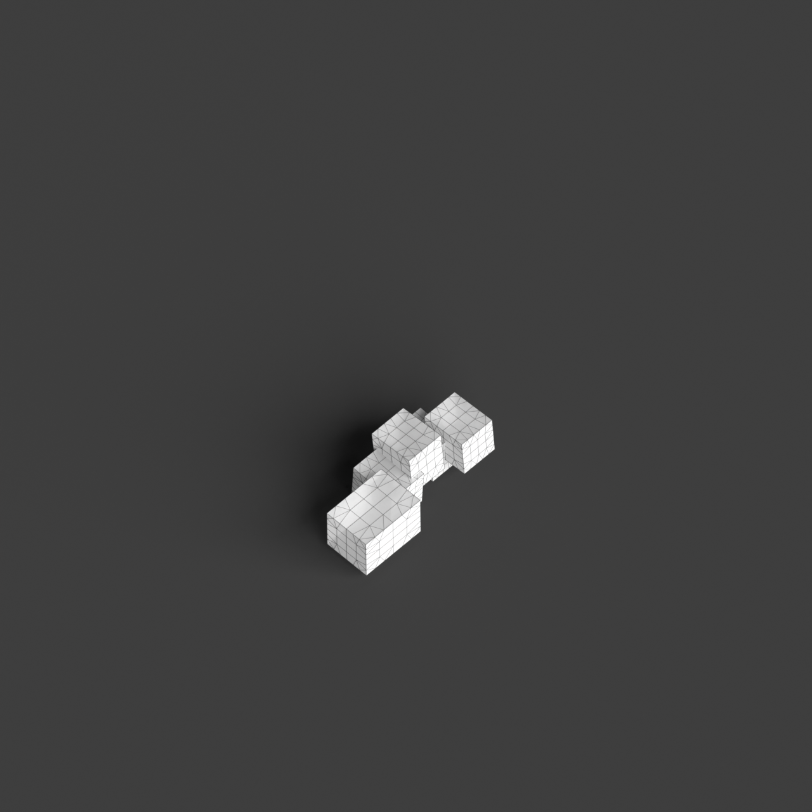
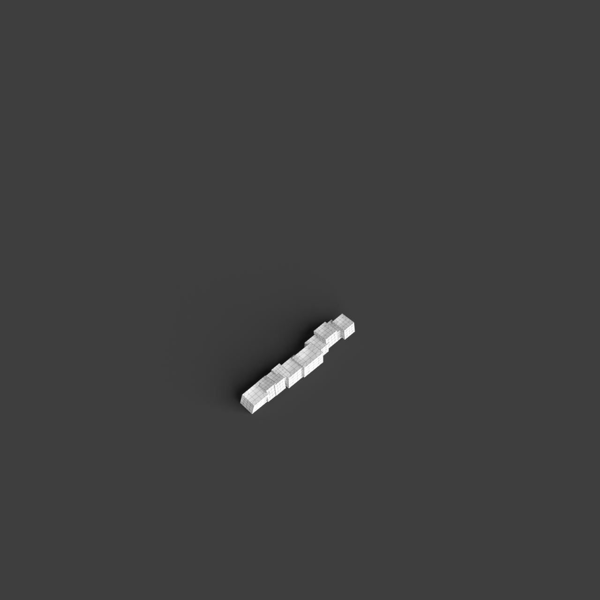

# 0005_0002_0004_distorted_puzzle  
         
## Interpretation  
  
### Implications_form :  
The &#x27;Distorted puzzle&#x27; metaphor implies a building form with a silhouette that is both fragmented and cohesive, where individual elements appear to be in a state of tension yet fit together as a whole. The massing should convey complexity through the stacking and overlapping of forms that create voids and niches, suggesting a playful yet deliberate arrangement. Spatial relationships should reflect a labyrinthine quality with unexpected transitions and connections, encouraging curiosity and interaction among users. The design should feature varied perspectives and alignments that challenge perceptions of order and symmetry.  
### Metaphor :  
Distorted puzzle  
### Key_traits :  
The metaphor &#x27;Distorted puzzle&#x27; implies a design characterized by a complex, interlocking arrangement of forms or spaces that appear to be slightly misaligned or irregularly shaped. This concept suggests a dynamic interplay of parts that fit together in unexpected ways, creating a sense of movement and tension. The distorted aspect brings a sense of unpredictability and visual interest, while the puzzle nature indicates coherence and interconnectedness in the overall structure.  
### Design_task :  
Develop an Architectural Concept Model for the &#x27;Distorted puzzle&#x27; metaphor by creating a series of fragmented yet interconnected modules. Experiment with stacking and overlapping these modules to form a cohesive whole that suggests movement and tension. Focus on creating a labyrinthine spatial arrangement, with pathways and spaces that change direction and perspective, inviting exploration. Use varied forms and alignments to challenge traditional notions of order, ensuring that the overall composition remains coherent and interconnected. The model should evoke curiosity and engagement, embodying the unpredictable yet unified nature of a distorted puzzle.  
## Agent summary :  
The provided function, `create_distorted_puzzle_model`, generates an architectural concept model inspired by the &quot;Distorted puzzle&quot; metaphor. It creates a series of fragmented, interconnected modules that are stacked and overlapped, embodying the metaphor&#x27;s themes of tension and cohesion. Parameters, such as base size and overlap factor, dictate the dimensions and arrangement of each module, while random height variations and slight rotations introduce unpredictability. The resulting spatial arrangement is labyrinthine, promoting exploration through varied perspectives and unexpected transitions, ultimately evoking curiosity and interaction. This approach encapsulates the metaphor&#x27;s essence, merging complexity with coherence in the design.