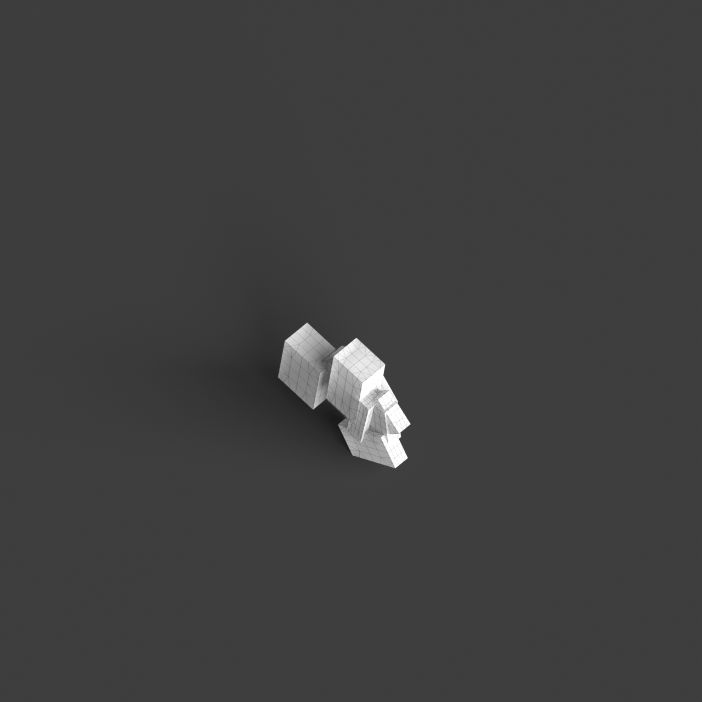
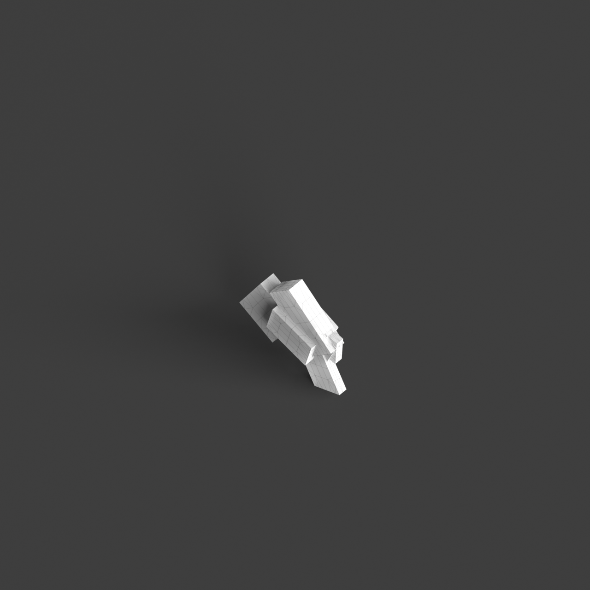
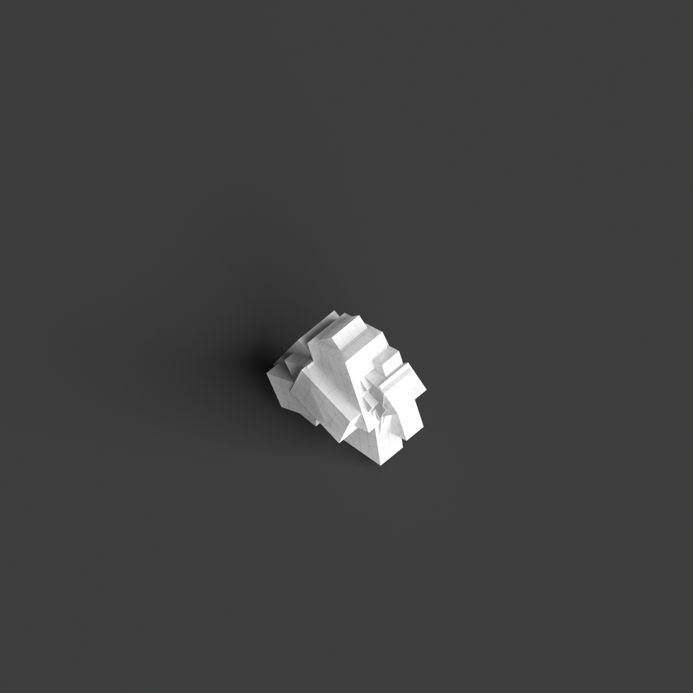

# 0005_0003_0001_distorted_puzzle  
         
## Interpretation  
  
### Implications_form :  
The &#x27;Distorted puzzle&#x27; metaphor suggests a building form characterized by a multifaceted geometry where individual elements appear to be slightly twisted or rotated, creating a sense of dynamic imbalance. The massing should reflect a playful juxtaposition of forms with varying scales and orientations, enhancing the visual complexity and tension. Spatially, the design should incorporate a network of interdependent rooms and corridors, each with unique shapes and angles, that collectively form a cohesive whole. The overall structure should convey a sense of exploration, with spaces that appear to shift and transform as one moves through them, maintaining a balance between disorder and unity.  
### Metaphor :  
Distorted puzzle  
### Key_traits :  
The metaphor &#x27;Distorted puzzle&#x27; implies a design characterized by a complex, interlocking arrangement of forms or spaces that appear to be slightly misaligned or irregularly shaped. This concept suggests a dynamic interplay of parts that fit together in unexpected ways, creating a sense of movement and tension. The distorted aspect brings a sense of unpredictability and visual interest, while the puzzle nature indicates coherence and interconnectedness in the overall structure.  
### Design_task :  
Design an Architectural Concept Model for the &#x27;Distorted puzzle&#x27; metaphor by composing a series of geometric elements that are slightly twisted or rotated relative to each other. Focus on creating a visual dialogue between these elements through varying scales and orientations to emphasize the distorted aspect. Develop a spatial network of interconnected rooms and pathways that shift in size and shape, guiding movement through a series of unexpected turns and transitions. The model should convey a sense of dynamic imbalance, while maintaining an underlying structural coherence that reflects the interconnected nature of a puzzle. Aim to evoke a sense of exploration and transformation within the space.  
## Agent summary :  
The provided function, `create_distorted_puzzle_model`, generates an architectural concept model inspired by the &quot;Distorted puzzle&quot; metaphor. It creates a series of geometric elements that are slightly twisted and rotated, reflecting dynamic imbalance and visual complexity. Each element is randomly scaled and positioned, simulating the playful juxtaposition of varying forms. The function incorporates transformations, such as twisting and translating, to develop interconnected rooms and corridors that shift in size and shape, evoking a sense of exploration. This approach captures the essence of interconnectedness and disorder, aligning with the metaphor&#x27;s emphasis on dynamic spatial relationships and coherence.