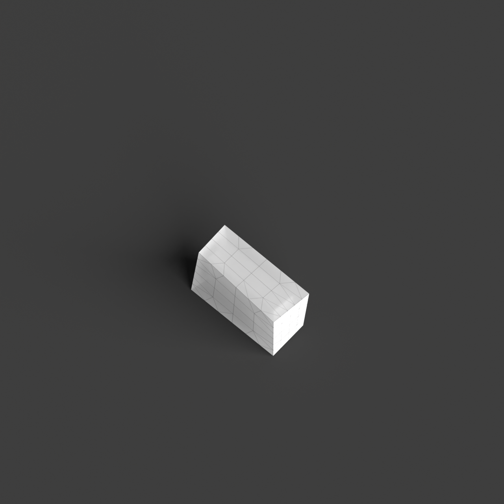
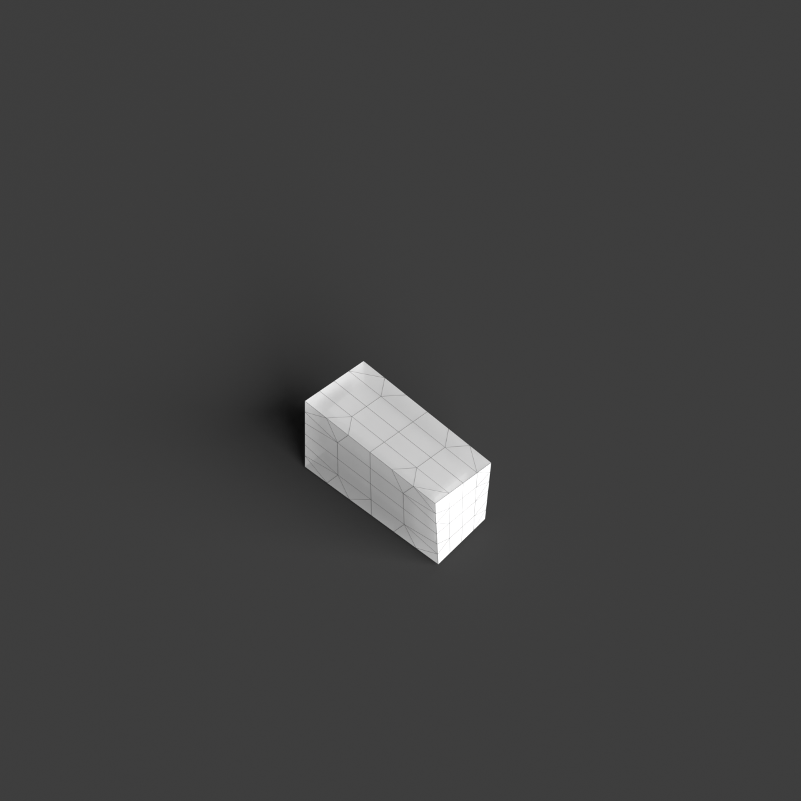
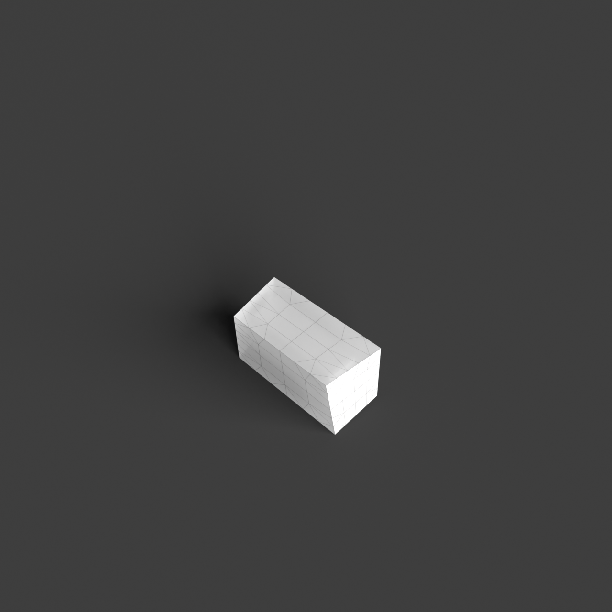
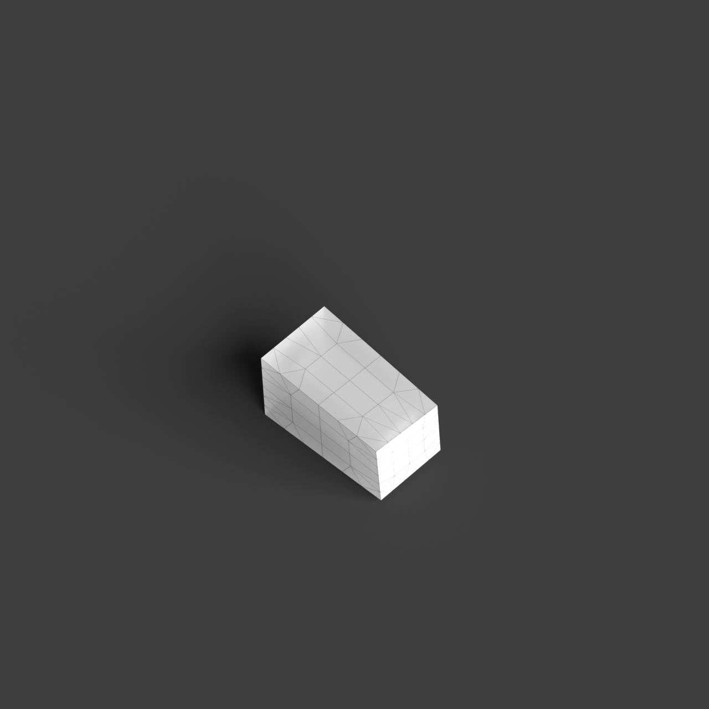

# 0006_0001_0005_box_in_a_cloud  
         
## Interpretation  
  
### Implications_form :  
The &#x27;Box in a cloud&#x27; metaphor suggests a building form where a solid, geometric core is enveloped by a lighter, more diffuse envelope. The massing would consist of a strong, defined central volume (the &#x27;box&#x27;) that provides structural stability and spatial anchoring. This core could be surrounded by layers of translucent or perforated materials that form the &#x27;cloud&#x27;, creating a sense of lightness and movement. Spatially, there is a transition from the structured, enclosed spaces of the box to the open, fluid spaces of the cloud. This metaphor informs an arrangement where the central &#x27;box&#x27; functions as the primary programmatic space, while the surrounding &#x27;cloud&#x27; offers transitional and flexible uses, perhaps as circulation or communal areas. The silhouette of the building would contrast the sharp edges of the box with the soft, flowing lines of the cloud, creating an interplay between defined and blurred edges.  
### Metaphor :  
Box in a cloud  
### Key_traits :  
This metaphor suggests a juxtaposition of solidity and ethereality, where a defined, geometric form is enveloped by a more diffuse, dynamic presence. The design could explore the interplay between robust, structured elements and lighter, more amorphous features, emphasizing contrast between opacity and translucency, weight and lightness, defined boundaries and blurred edges. It encourages a dialogue between the grounded and the ephemeral, inviting exploration of spatial layers and transitions.  
### Design_task :  
Create an Architectural Concept Model that embodies the &#x27;Box in a cloud&#x27; metaphor. Begin by constructing a central, geometric form that represents the &#x27;box&#x27;. Use solid materials or techniques that convey weight and permanence. Surround this core with a secondary layer that represents the &#x27;cloud&#x27;. This layer should be made using lighter, translucent, or perforated materials to suggest ethereality and movement. Consider using materials like frosted acrylic, mesh, or fabric. The model should emphasize the contrast between the structured core and the flowing envelope. Pay attention to the transitions between the two elements, ensuring there is a clear spatial dialogue. Experiment with lighting to enhance the sense of opacity versus translucency, and explore how shadows and reflections play on the surfaces, further blurring the boundaries between the &#x27;box&#x27; and the &#x27;cloud&#x27;.  
## Agent summary :  
The function `create_box_in_cloud_concept` generates an architectural concept model based on the &quot;Box in a cloud&quot; metaphor by creating a central geometric &quot;box&quot; and surrounding it with a lighter, ethereal &quot;cloud.&quot; It establishes the box using defined dimensions and solid materials, symbolizing stability. The cloud layer is created with a perturbation effect, adding randomness to its shape, representing lightness and movement. This juxtaposition emphasizes the contrast between the solid core and the fluid envelope, facilitating a spatial dialogue. The model&#x27;s design explores transitions and interactions between these two elements, enhancing the thematic concept of solidity versus ethereality.