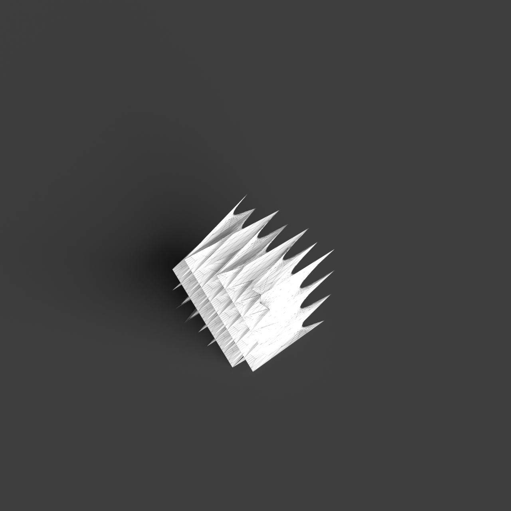
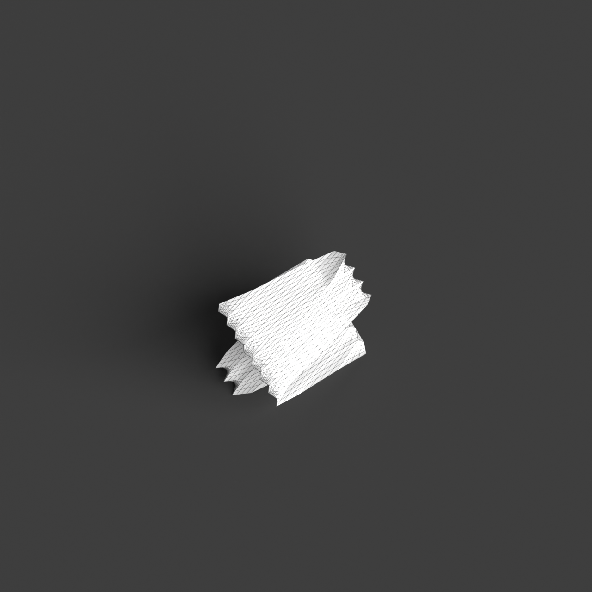
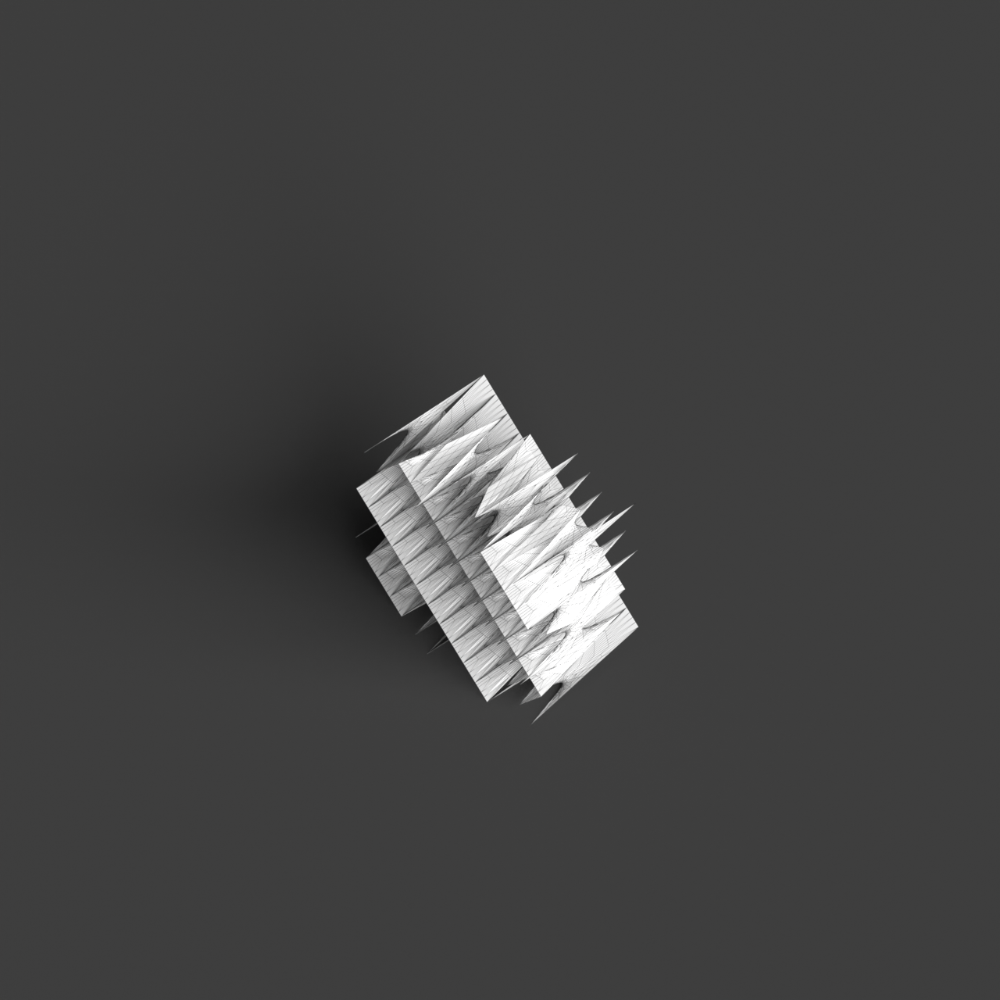
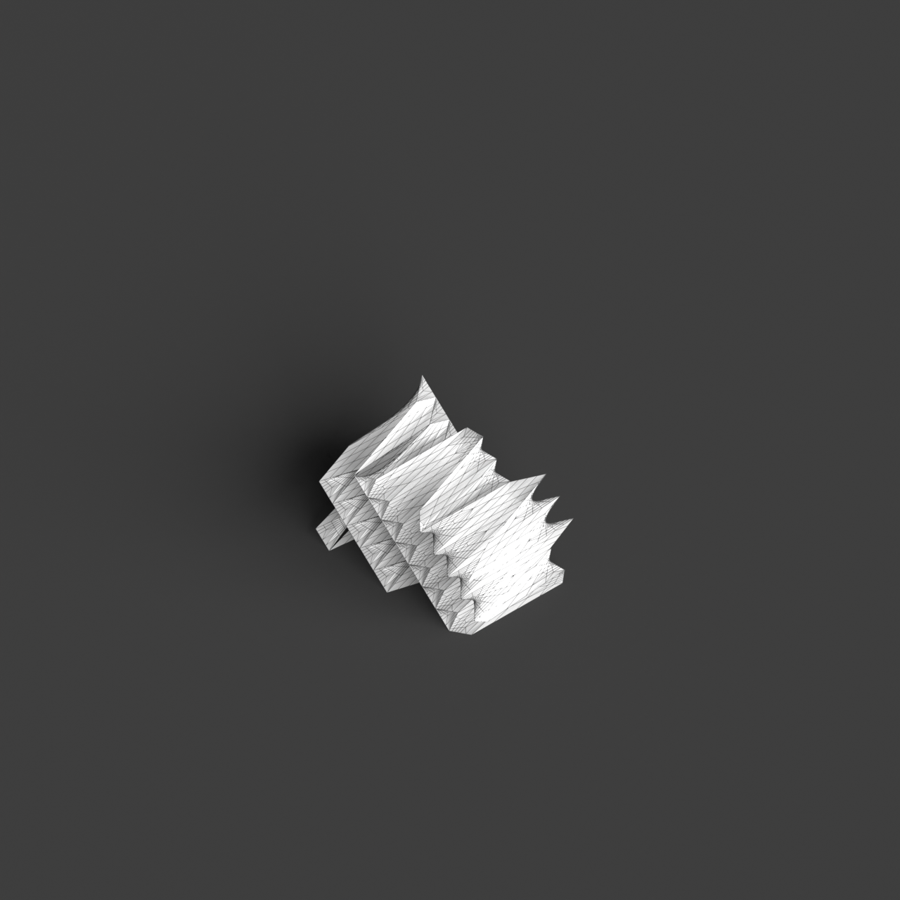

# 0007_0005_0005_rippled_grid  
         
## Interpretation  
  
### Implications_form :  
The metaphor &#x27;rippled grid&#x27; suggests that the building&#x27;s form and massing should exhibit a dynamic and rhythmic quality, akin to waves or ripples moving across a structured grid. The geometry might include undulating surfaces that convey fluidity and movement, while the underlying structure maintains a regular grid-like order. The silhouette of the building could reflect these waves, creating a visually engaging and harmonious interplay between structure and fluidity. Spatial relationships within the building should be organized to reflect this balance between movement and order, with spaces that flow into one another while adhering to an overall grid-based logic.  
### Metaphor :  
rippled grid  
### Key_traits :  
The metaphor &#x27;rippled grid&#x27; suggests a dynamic and rhythmic spatial quality. It implies a structured yet fluid pattern reminiscent of waves or ripples that propagate across a uniform grid. This can translate into architectural designs that incorporate undulating surfaces or facades, creating a sense of movement and flow while maintaining an underlying order and regularity.  
### Design_task :  
Create an Architectural Concept Model that embodies the &#x27;rippled grid&#x27; metaphor by developing a series of undulating surfaces or facades that overlay a regular grid structure. Use a combination of materials or textures to emphasize the ripple effect in contrast with the grid. Explore spatial arrangements that allow for fluid transitions between areas, while still maintaining a sense of underlying order. Focus on creating a model that visually communicates the dynamic interplay between the structured grid and the rhythmic, wave-like forms.  
## Agent summary :  
The provided function generates an architectural concept model based on the &quot;rippled grid&quot; metaphor by creating a series of undulating surfaces that overlay a structured grid. It defines a grid using specified dimensions and calculates the height of each point in the grid according to a sinusoidal wave function, simulating the ripple effect. The function then constructs 3D surface patches from these calculated points, embodying the dynamic interplay of fluidity and order. By adjusting parameters like ripple amplitude and frequency, the model emphasizes the rhythmic quality suggested by the metaphor while maintaining a coherent grid structure.