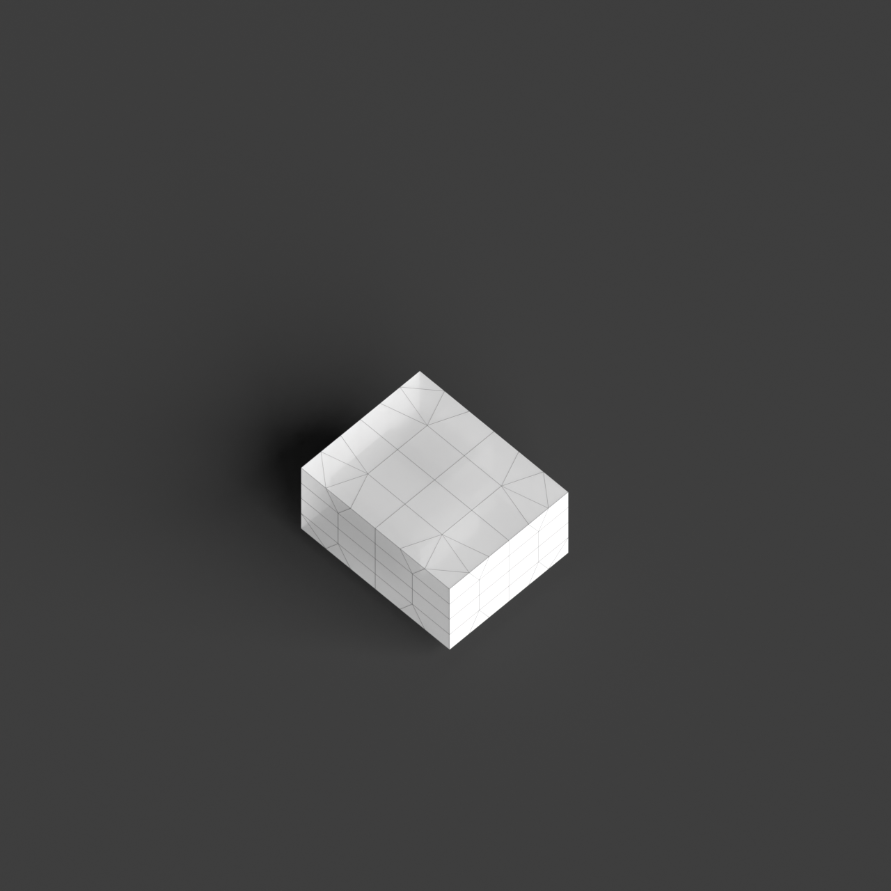
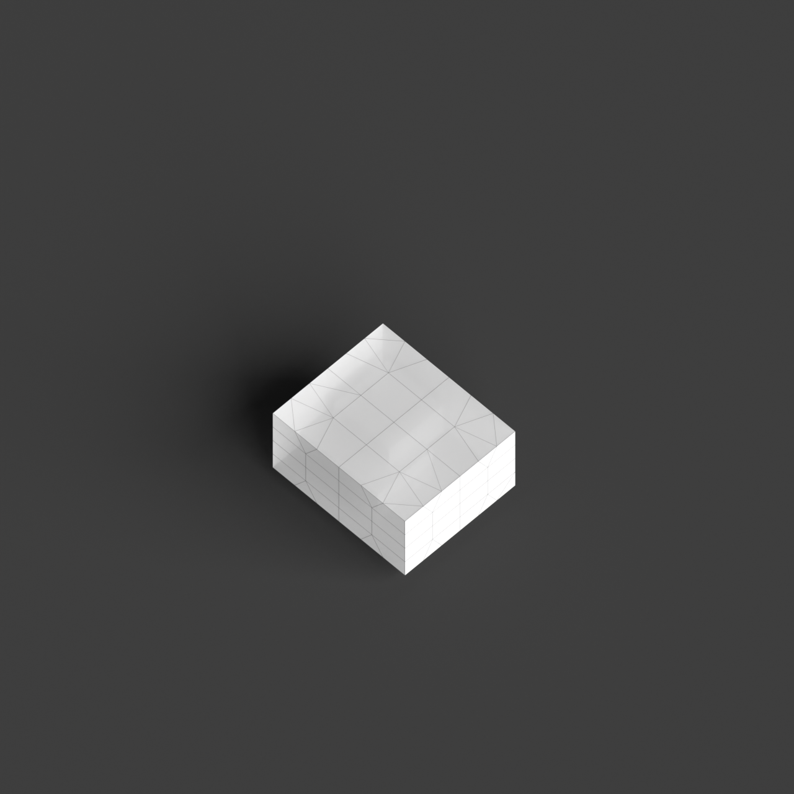
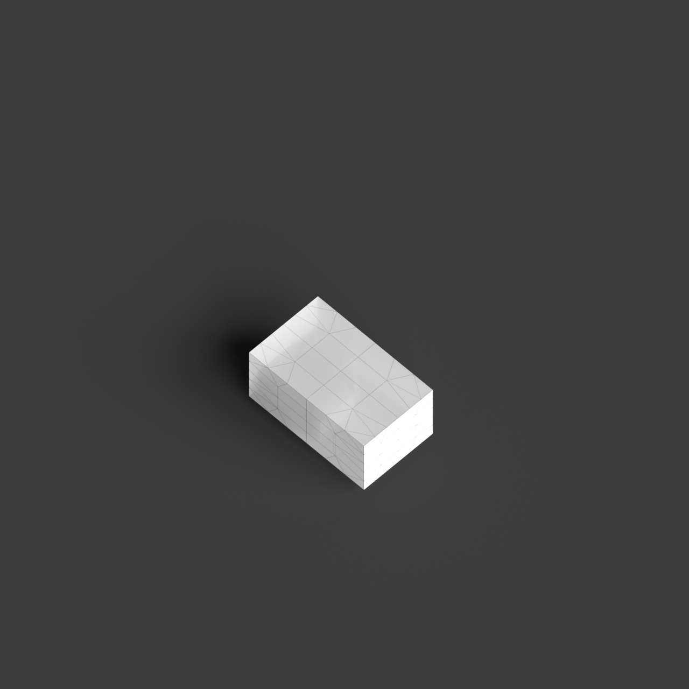
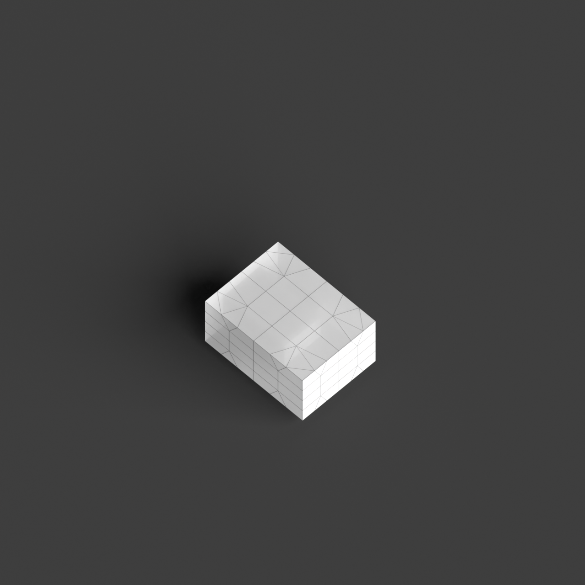
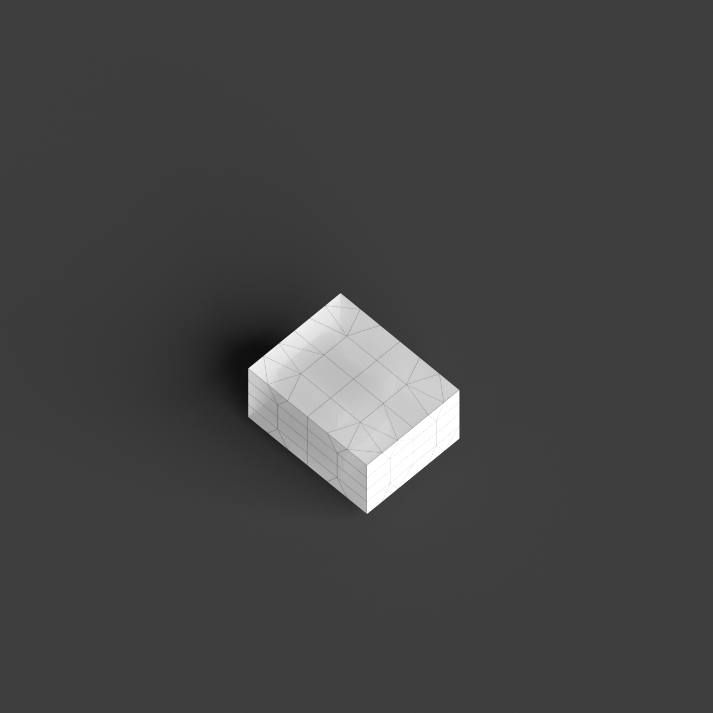

# 0009_0003_0003_cantilevering_corners  
         
## Interpretation  
  
### Implications_form :  
The metaphor of &#x27;Cantilevering corners&#x27; suggests a design where the building&#x27;s massing incorporates extensions that protrude from a central base, creating a bold and visually striking form. These projections give the building a silhouette that balances between grounded stability and outward motion. Spatially, the form is characterized by the contrast between anchored areas and those that appear to float, generating intriguing interstitial spaces and a dynamic sense of movement. The arrangement of these elements fosters a sense of exploration and invites interaction with the surrounding context.  
### Metaphor :  
Cantilevering corners  
### Key_traits :  
The metaphor implies a dynamic interaction between stability and motion, suggesting architectural elements that project outward from a structure with a sense of tension and balance. This can manifest in a building design where certain sections boldly jut out, creating dramatic overhangs or unexpected spaces that defy conventional expectations of gravity and support.  
### Design_task :  
Design an Architectural Concept Model that embodies &#x27;Cantilevering corners&#x27; by focusing on sectional interplay. Create a central mass from which various segments extend dramatically, each cantilevered at different heights and orientations. Emphasize the contrast between the substantial, stable core and the lighter, projecting sections by using different scales and materiality. Incorporate voids beneath the cantilevered portions to accentuate the sense of suspension and tension. Explore how these elements cast shadows and interact with natural light to enhance the sense of movement and balance, while also considering how the model engages with its environment and invites exploration through its dynamic composition.  
## Agent summary :  
The function `create_cantilevered_concept_model` generates an architectural concept model by interpreting the metaphor of &quot;Cantilevering corners.&quot; It constructs a central mass and attaches multiple cantilevered segments, each extending outward at varying heights and orientations. This design emphasizes the tension between stability and motion, creating a striking silhouette. The function incorporates voids beneath the cantilevers to enhance the feeling of suspension, while the varied scales and materials differentiate the solid core from the lighter extensions. Additionally, the model&#x27;s interplay with light and shadows invites exploration and interaction with the surrounding environment, embodying the metaphor&#x27;s dynamic nature.