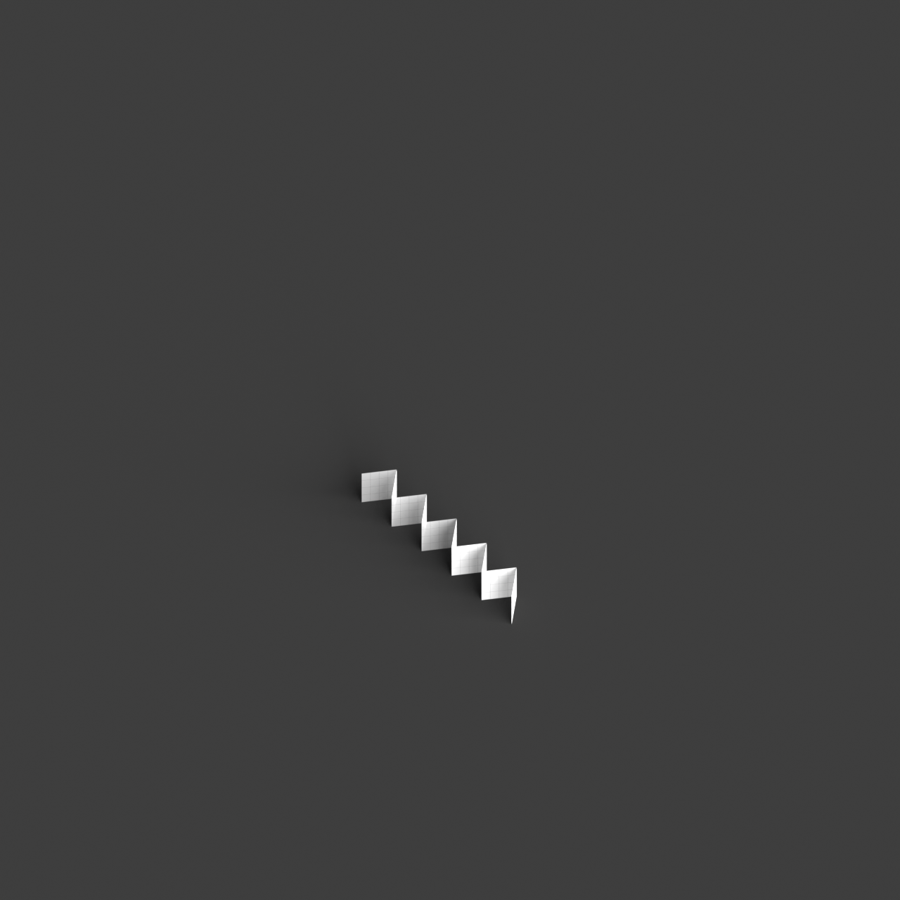
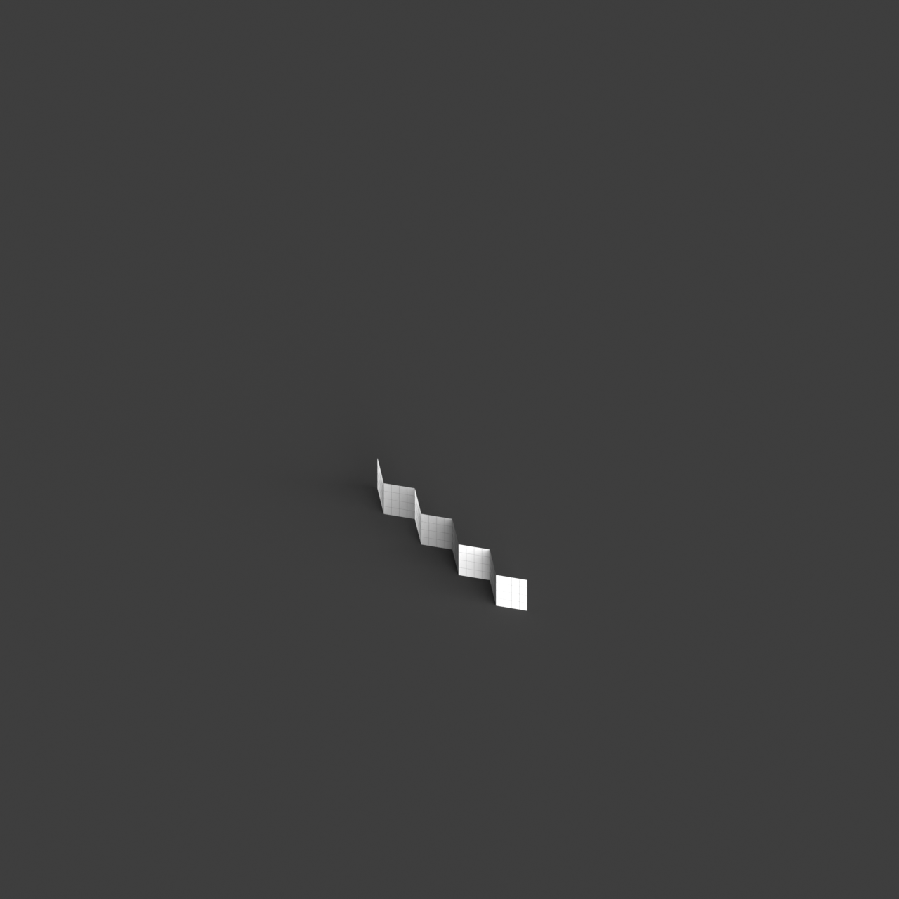

# 0010_0004_0001_mirrored_folded_planes  
         
## Interpretation  
  
### Implications_form :  
The metaphor &#x27;Mirrored folded planes&#x27; implies a building form characterized by a series of angular planes that appear folded and are reflected to create a harmonious yet complex structure. The mirroring of these folded planes suggests a bilateral or radial symmetry, enhancing the perception of depth and movement within the building&#x27;s silhouette. This concept influences the building&#x27;s massing to showcase a dynamic interplay of solid and void, light and shadow, creating a vibrant visual rhythm. Spatially, this metaphor could lead to a design where spaces are organized in layers, reflecting each other in a cascading manner, promoting a sense of progression and discovery.  
### Metaphor :  
Mirrored folded planes  
### Key_traits :  
This metaphor suggests a design driven by the interplay of symmetry and complexity. The &#x27;folded planes&#x27; introduce dynamic, angular forms that create a sense of movement and depth, while &#x27;mirrored&#x27; implies a reflective symmetry, doubling the visual impact and creating harmonious balance. This combination can lead to spaces that are both intricate and coherent, with a rhythmic repetition of forms that draw the eye and engage the viewer in an exploration of layered geometries.  
### Design_task :  
Develop an Architectural Concept Model that embodies the &#x27;Mirrored folded planes&#x27; metaphor by integrating a series of angular, folded surfaces that exhibit bilateral or radial symmetry. Focus on creating a sense of depth and movement through strategic folding and mirroring, using materials that highlight shadow and light interactions. Design the spatial layout to reflect a cascading organization, where spaces unfold in layers, mirroring each other to create a dynamic and progressive experience. The model should emphasize the balance between visual complexity and structural harmony, encouraging exploration through its intricate, layered geometries.  
## Agent summary :  
The function `create_mirrored_folded_planes_model` generates an architectural concept model inspired by the metaphor of &quot;Mirrored folded planes.&quot; By defining a base plane and a specified number of folds, it creates a series of angular, reflective surfaces that embody bilateral symmetry. The function constructs points for folded planes, generates lofted surfaces to represent folds, and mirrors these surfaces to enhance the visual complexity. This process creates dynamic geometries that interplay with light and shadow, while layering spaces to evoke a sense of depth and discovery, aligning with the design task&#x27;s requirements for spatial organization and aesthetic balance.