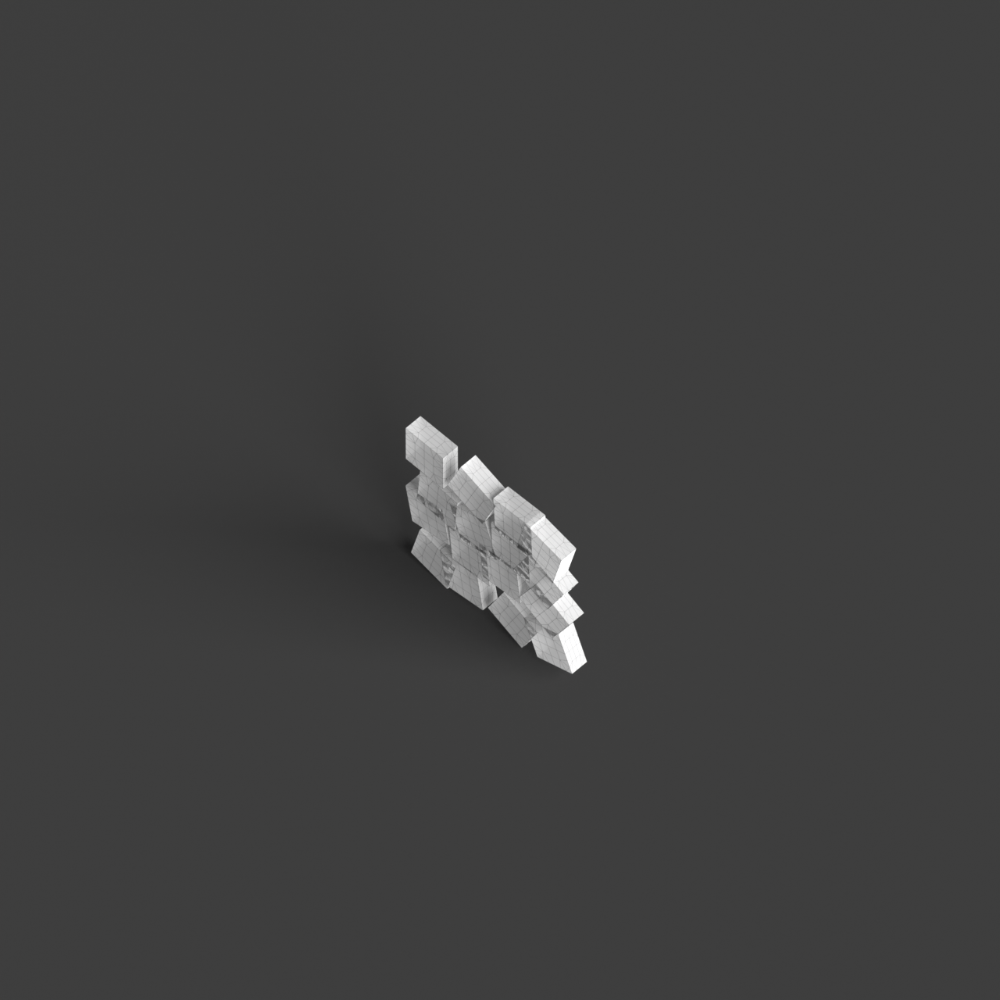
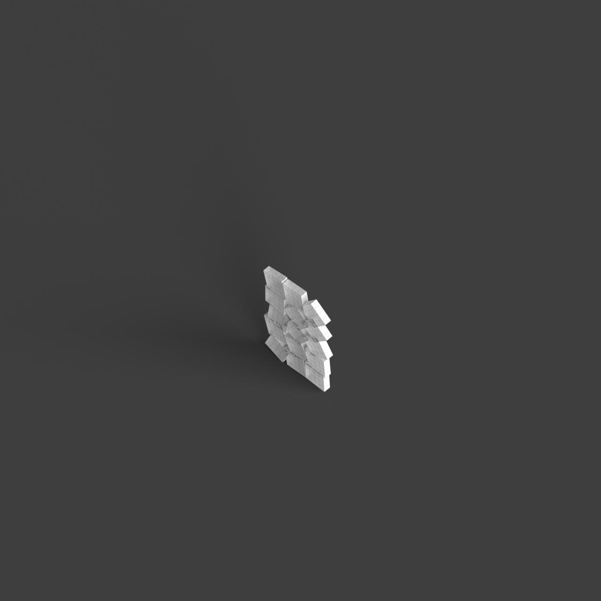
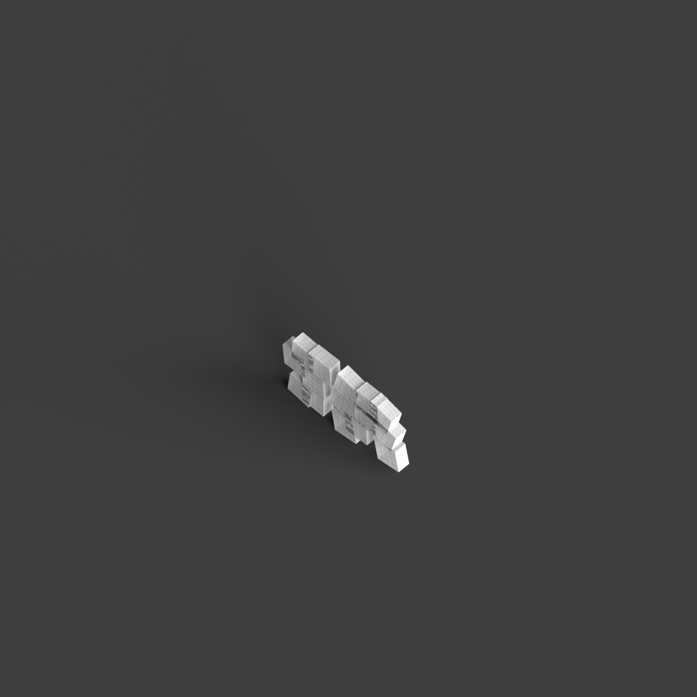
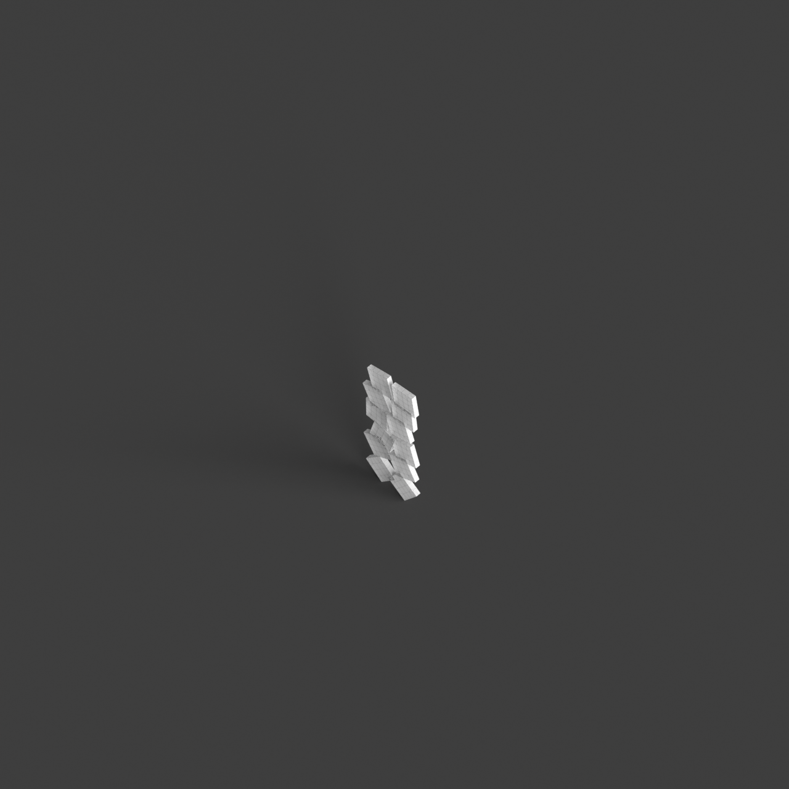

# 0011_0001_0005_shifted_grid  
         
## Interpretation  
  
### Implications_form :  
The &#x27;Shifted Grid&#x27; metaphor suggests a building form that breaks away from conventional orthogonal massing, introducing elements that are tilted or rotated to create a sense of movement and dynamism. The geometry might include intersecting planes and shifted volumes that interact in unexpected ways, producing a silhouette with varied angles and projections. Spatially, the metaphor encourages a layout where spaces are arranged in a non-linear fashion, promoting diverse circulation paths and creating distinct zones that vary in scale and function. This allows for a playful engagement with light and shadow, as well as opportunities for adaptable and flexible spaces that can accommodate multiple uses.  
### Metaphor :  
Shifted grid  
### Key_traits :  
The shifted grid metaphor implies a dynamic reconfiguration of a regular pattern, creating a sense of movement and fluidity within the structure. It suggests a departure from traditional orthogonal layouts, introducing unexpected alignments and intersections. This can lead to innovative spatial arrangements, where the shift creates opportunities for varied circulation paths, diverse spatial experiences, and a playful interaction with light and shadow. The shifted grid also allows for adaptability and flexibility in design, accommodating diverse functions and fostering a sense of discovery as occupants navigate through the space.  
### Design_task :  
Create an Architectural Concept Model that embodies the &#x27;Shifted Grid&#x27; metaphor by starting with a regular grid pattern and then selectively shifting certain elements. Use intersecting planes and rotated volumes to illustrate the dynamic reconfiguration of the grid. Focus on creating varied circulation paths and distinct spatial zones that promote diverse spatial experiences. Experiment with light and shadow by introducing angled surfaces and projections that cast varying shadows throughout the model. The model should convey a sense of adaptability, with spaces that can be reconfigured to accommodate different functions, encouraging exploration and discovery within the design.  
## Agent summary :  
The function `create_shifted_grid_concept_model` generates an architectural concept model based on the &#x27;Shifted Grid&#x27; metaphor by constructing a regular grid pattern of 3D elements. It selectively shifts and rotates these elements, introducing dynamic spatial arrangements that deviate from traditional orthogonality. Each element can be altered in position and orientation, creating varied circulation paths and distinct spatial zones. The model emphasizes adaptability and fluidity, allowing for multiple uses and engaging interactions with light and shadow through angled surfaces. This approach fosters exploration and discovery within the design, aligning with the metaphor&#x27;s implications of movement and flexibility.