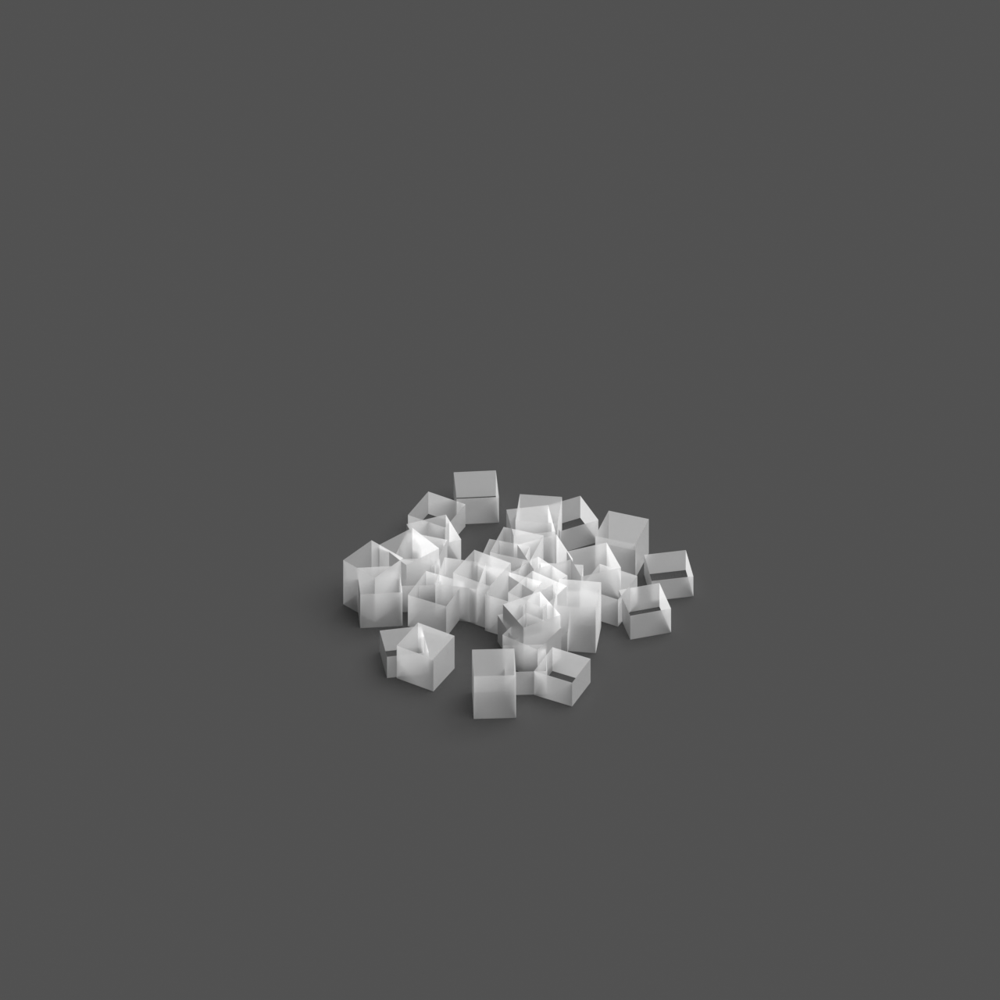
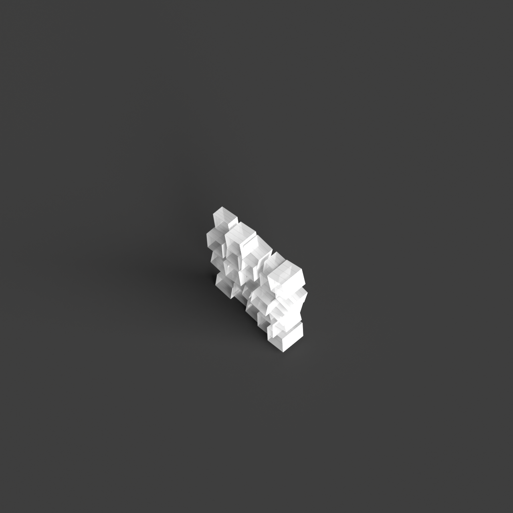

# 0011_0005_0005_shifted_grid  
         
## Interpretation  
  
### Implications_form :  
The &#x27;Shifted Grid&#x27; metaphor suggests a transformation of traditional grid-based architecture into a more dynamic and interactive form. The building&#x27;s massing and silhouette are characterized by elements that appear to be in motion, as if parts of the grid have been pushed or pulled out of alignment, creating a sense of fluidity and energy. This results in a structure with volumes that are staggered, skewed, or rotated, producing unexpected intersections and a silhouette that captures the eye with its irregularity and complexity. Spatially, the metaphor promotes a non-traditional arrangement of spaces, encouraging innovative circulation paths that lead to a variety of spatial experiences. The interaction of light and shadow is accentuated by the shifted elements, casting interesting and varied patterns throughout the structure. The metaphor also implies adaptability, with spaces that can easily transform to accommodate different functions, inviting exploration and discovery.  
### Metaphor :  
Shifted grid  
### Key_traits :  
The shifted grid metaphor implies a dynamic reconfiguration of a regular pattern, creating a sense of movement and fluidity within the structure. It suggests a departure from traditional orthogonal layouts, introducing unexpected alignments and intersections. This can lead to innovative spatial arrangements, where the shift creates opportunities for varied circulation paths, diverse spatial experiences, and a playful interaction with light and shadow. The shifted grid also allows for adaptability and flexibility in design, accommodating diverse functions and fostering a sense of discovery as occupants navigate through the space.  
### Design_task :  
Develop an Architectural Concept Model that embodies the &#x27;Shifted Grid&#x27; metaphor by beginning with a standard grid framework and applying shifts, rotations, and misalignments to create a sense of movement and fluidity. Employ a combination of staggered volumes and intersecting planes to articulate the dynamic nature of the metaphor. Focus on crafting a non-linear spatial arrangement that encourages diverse circulation paths and unique spatial experiences. Highlight the interaction of light and shadow by incorporating elements that create varying shadow patterns, enhancing the model&#x27;s sense of energy and dynamism. Ensure the model demonstrates adaptability, with spaces designed to be flexible and capable of accommodating multiple functions, fostering a sense of discovery and engagement as occupants navigate through the design.  
## Agent summary :  
The function `generate_shifted_grid_concept` creates an architectural concept model based on the &#x27;Shifted Grid&#x27; metaphor by starting with a standard grid framework. It applies random shifts and rotations to grid elements, resulting in a dynamic arrangement that embodies movement and fluidity. Each grid cell is extruded into a 3D volume, incorporating variations in height to enhance visual complexity. This approach fosters innovative spatial arrangements and diverse circulation paths, while the shifting elements create intriguing light and shadow interactions. The adaptability of the spaces encourages exploration, aligning with the metaphor&#x27;s emphasis on transformation and engagement in architecture.