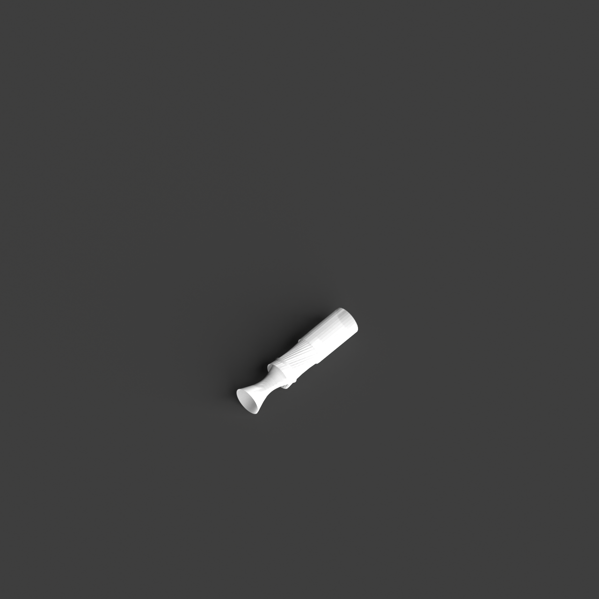
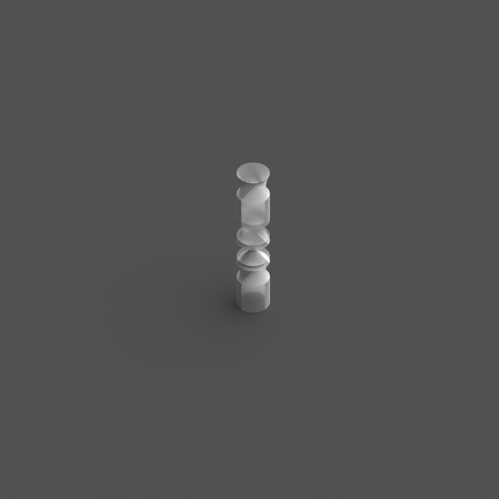

# 0012_0002_0004_twisted_volumes  
         
## Interpretation  
  
### Implications_form :  
The metaphor &#x27;Twisted volumes&#x27; shapes the building&#x27;s form and massing by employing a series of interwoven and spiraling forms that create a sense of fluidity and motion. The silhouette becomes a complex interplay of angles and curves, projecting an image of constant evolution. In terms of spatial relationships, the twisting introduces a layered experience where spaces overlap and intersect in novel ways, promoting unexpected interactions and views. The arrangement of spaces becomes more dynamic, encouraging exploration and discovery. This twisting motion also amplifies the play of natural light, as the varied surfaces and orientations allow for dramatic shifts in light and shadow throughout the day, highlighting different aspects and moods of the structure.  
### Metaphor :  
Twisted volumes  
### Key_traits :  
The metaphor &#x27;Twisted volumes&#x27; suggests dynamic and fluid forms that manipulate perception through rotation and distortion. By twisting the volumes, the design conveys movement and tension, creating a sense of energy and transformation. This approach can lead to unexpected spatial relationships and perspectives, allowing for innovative circulation paths and enhancing the interaction between interior and exterior spaces. The twisting action also implies a play with light and shadow, as the changing angles capture and reflect light differently throughout the day.  
### Design_task :  
To evoke the &#x27;Twisted volumes&#x27; metaphor in an Architectural Concept Model, construct a series of interlocking modules that spiral and weave through each other. Focus on creating a sense of movement and tension by varying the angle and extent of the twists. Explore the potential for layered and intersecting spaces that encourage unique spatial interactions and flow. Consider the contrast between solid and void, using cutouts or transparent materials to emphasize the interplay of light and shadow. Experiment with different textures and finishes to highlight the dynamic nature of the twisted forms. The model should capture the transformative quality of the metaphor, illustrating how the twisting action influences both the form and the experience of space, while maintaining a coherent yet complex visual impact.  
## Agent summary :  
The provided function, `generate_twisted_volumes_model`, creates an architectural concept model inspired by the metaphor &quot;Twisted volumes.&quot; It constructs a series of interlocking cylindrical forms that twist around a vertical axis, reflecting fluidity and motion. Each cylindrical layer is slightly rotated and vertically offset to enhance the dynamic interplay of angles and curves, fostering unique spatial experiences. The function allows for customization of parameters like base radius, height, twist angle, and the number of layers, which together influence the model&#x27;s visual complexity and interaction with light. The result is a striking representation of movement and transformation in architectural design.