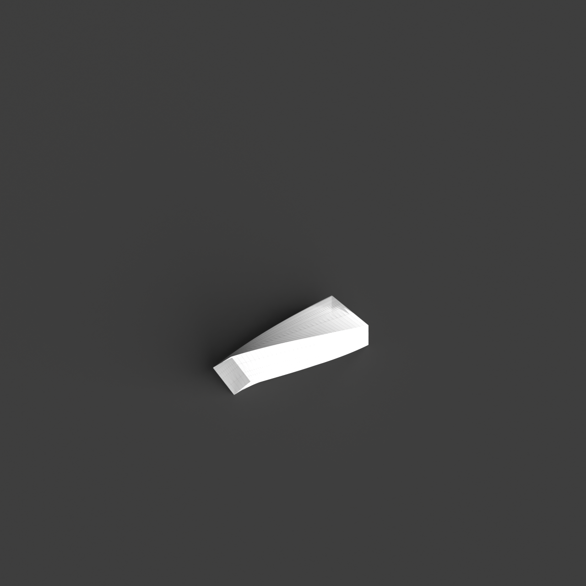
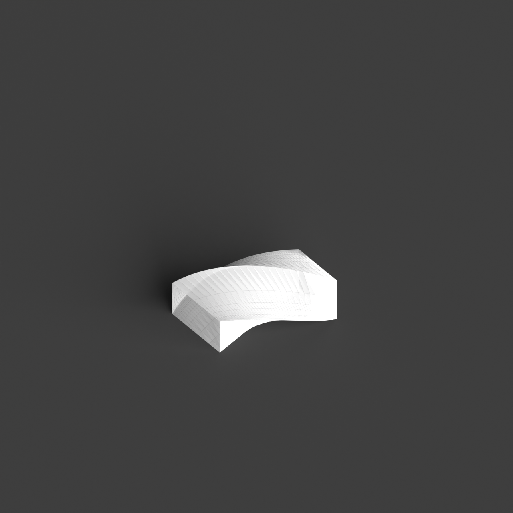
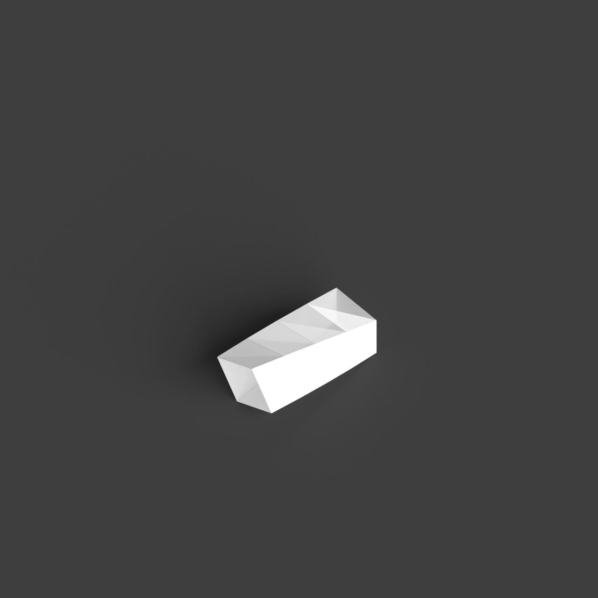
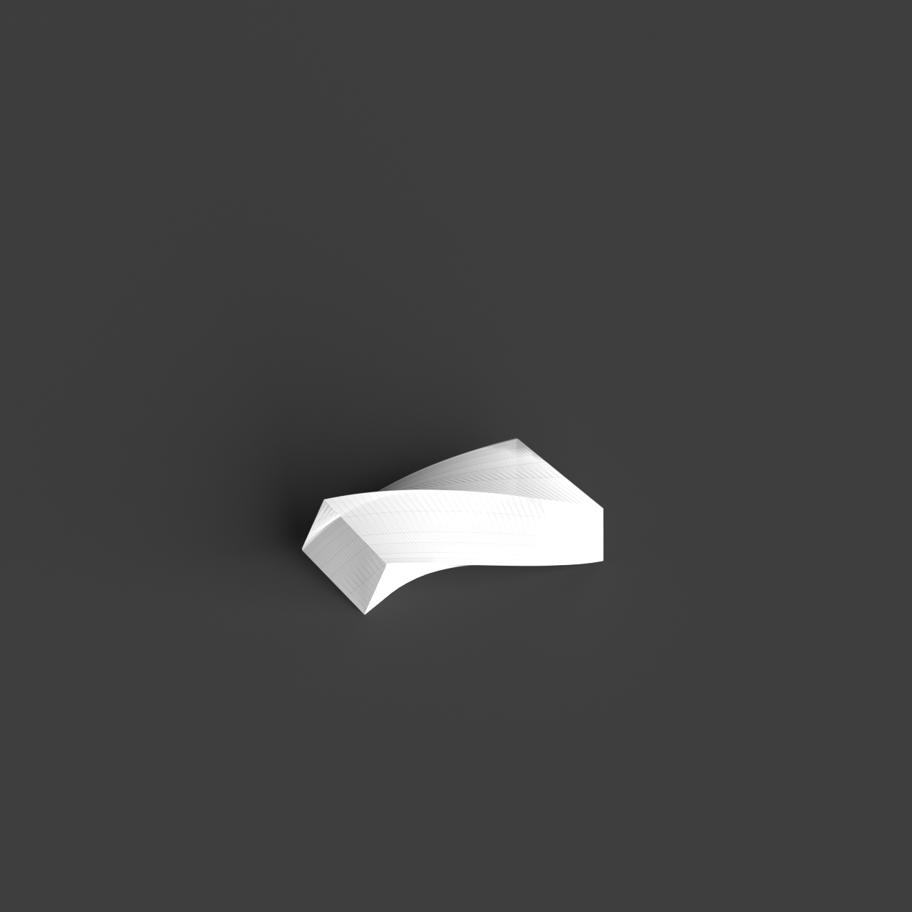
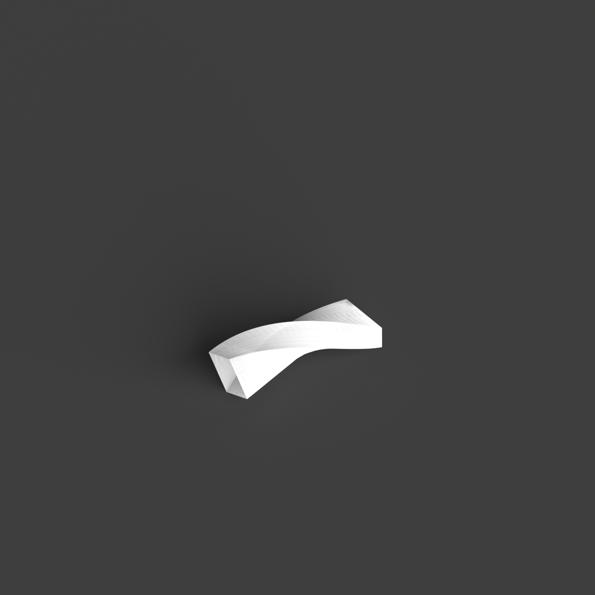

# 0012_0003_0004_twisted_volumes  
         
## Interpretation  
  
### Implications_form :  
The metaphor &#x27;Twisted volumes&#x27; shapes the building&#x27;s form and massing by integrating a series of volumetric elements that appear to be in a state of rotation and distortion. This creates a silhouette characterized by dynamic angularity and fluid curves, suggesting perpetual motion and transformation. The spatial relationships within the building become more fluid, as the twisting action leads to unexpected adjacencies and connections between spaces, fostering a sense of discovery. The interaction between interior and exterior is enriched, as the twists create a variety of perspectives and potential for unique visual and physical connections. Light and shadow are manipulated to dramatic effect, with the twisted surfaces capturing, refracting, and diffusing light in ever-changing patterns that animate the structure throughout the day.  
### Metaphor :  
Twisted volumes  
### Key_traits :  
The metaphor &#x27;Twisted volumes&#x27; suggests dynamic and fluid forms that manipulate perception through rotation and distortion. By twisting the volumes, the design conveys movement and tension, creating a sense of energy and transformation. This approach can lead to unexpected spatial relationships and perspectives, allowing for innovative circulation paths and enhancing the interaction between interior and exterior spaces. The twisting action also implies a play with light and shadow, as the changing angles capture and reflect light differently throughout the day.  
### Design_task :  
To evoke the &#x27;Twisted volumes&#x27; metaphor in an Architectural Concept Model, design a composition of interconnected volumetric elements that exhibit varying degrees of twist and distortion. Focus on creating a sense of dynamic movement through the manipulation of form and the use of non-linear geometries. Investigate the potential for programmatic and spatial fluidity by exploring how the twisted forms can facilitate novel spatial adjacencies and transitions. Emphasize the interplay of light and shadow by incorporating materials and textures that enhance the perception of depth and movement. Consider how the exterior silhouette can convey energy and transformation, while ensuring that the interior spatial logic remains coherent. The model should express the idea of continuous evolution and interaction, showcasing the metaphor&#x27;s influence on both form and spatial experience.  
## Agent summary :  
The provided function generates an architectural concept model inspired by the metaphor of &quot;Twisted volumes.&quot; It creates a series of interconnected volumetric elements that exhibit varying twists and distortions, reflecting dynamic movement and spatial fluidity. By defining parameters such as base dimensions, height, twist angle, and divisions, the function constructs a series of planes that are progressively rotated. This results in a lofted surface that embodies the metaphor&#x27;s essence, fostering unexpected spatial relationships and enhancing light and shadow interplay. The model ultimately conveys a sense of energy and transformation, aligning with the metaphor&#x27;s implications for architectural design.