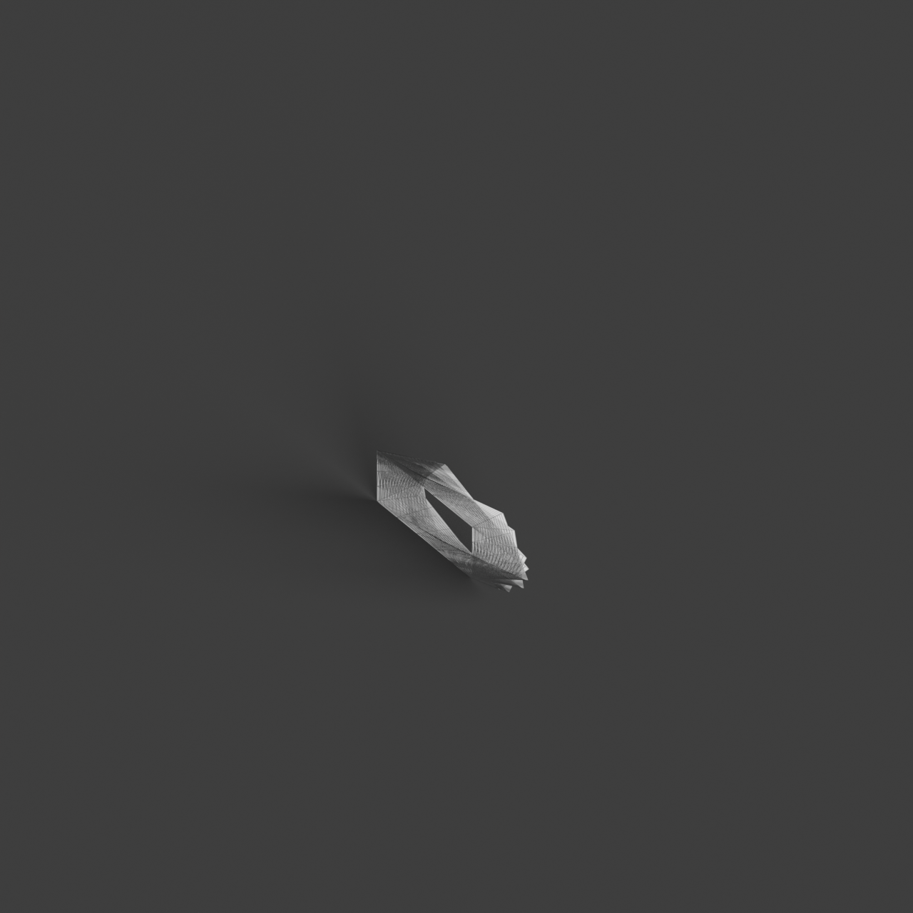
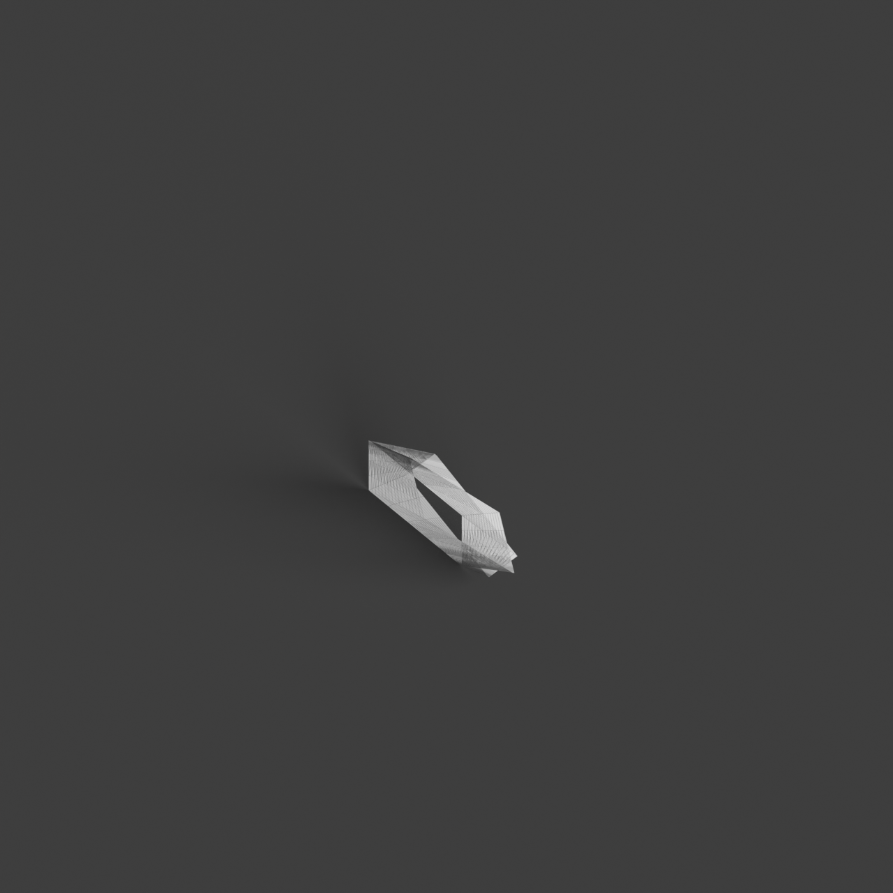

# 0012_0004_0005_twisted_volumes  
         
## Interpretation  
  
### Implications_form :  
The metaphor &#x27;Twisted volumes&#x27; influences the building&#x27;s form and massing by creating a series of overlapping and intersecting volumes that appear to be in constant rotation and transformation. This results in a silhouette that is dynamic and multifaceted, suggesting a continuous interplay between stability and motion. Spatial relationships within the building are reimagined through the twisting geometry, allowing for fluid transitions and unexpected connections between spaces. The interaction between interior and exterior spaces is enhanced, as the twisting forms create diverse visual access points and encourage an exchange between inside and outside environments. Additionally, the manipulation of light and shadow is pronounced, with the twisting surfaces providing opportunities for light to be angled, diffused, and refracted in complex patterns throughout the day.  
### Metaphor :  
Twisted volumes  
### Key_traits :  
The metaphor &#x27;Twisted volumes&#x27; suggests dynamic and fluid forms that manipulate perception through rotation and distortion. By twisting the volumes, the design conveys movement and tension, creating a sense of energy and transformation. This approach can lead to unexpected spatial relationships and perspectives, allowing for innovative circulation paths and enhancing the interaction between interior and exterior spaces. The twisting action also implies a play with light and shadow, as the changing angles capture and reflect light differently throughout the day.  
### Design_task :  
To embody the &#x27;Twisted volumes&#x27; metaphor in an Architectural Concept Model, develop a composition of layered and intersecting volumes that exhibit a range of twists and rotations. Focus on the tension and equilibrium within the geometry to create a sense of dynamic balance. Use cutouts and transparent elements to emphasize the interaction of light and shadow, allowing light to penetrate and transform the spaces. Experiment with the continuity and disruption of surfaces to explore different spatial experiences and perspectives. Consider how the exterior form can suggest both stability and motion, while maintaining a coherent internal spatial arrangement. The model should convey the transformative energy of the metaphor, highlighting how the twisted geometry can redefine the relationship between form, space, and light.  
## Agent summary :  
The provided function, `create_twisted_volumes`, generates an architectural concept model inspired by the metaphor &quot;Twisted volumes.&quot; It creates multiple overlapping and intersecting volumes with varying twists, simulating a dynamic interplay of stability and motion. Each volume is characterized by its height, base dimensions, and a defined twist angle, allowing for a diverse array of forms that capture light and shadow in complex ways. The function&#x27;s randomization in positioning and twisting enhances the model&#x27;s dynamism, promoting innovative spatial relationships and a fluid interaction between interior and exterior spaces, thereby embodying the transformative energy of the metaphor.