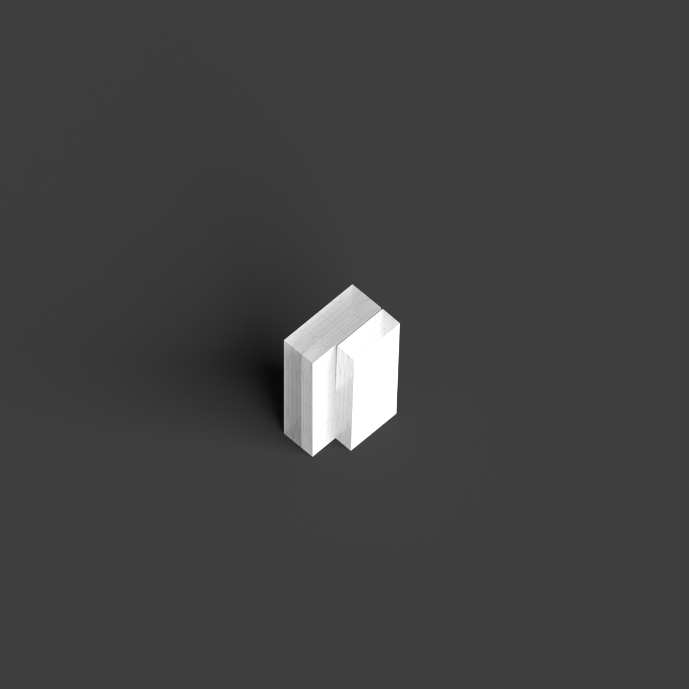
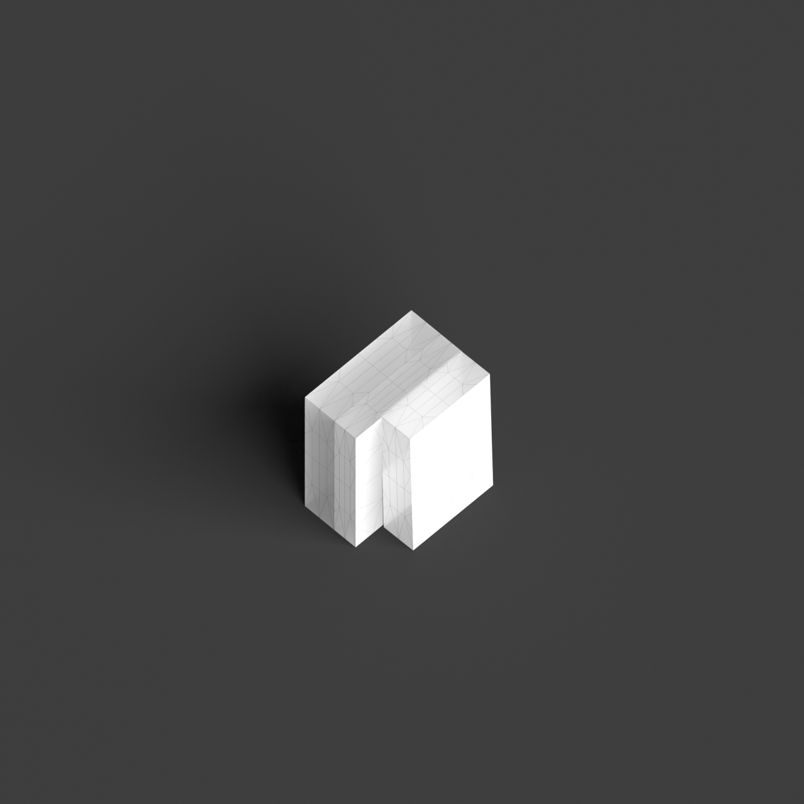
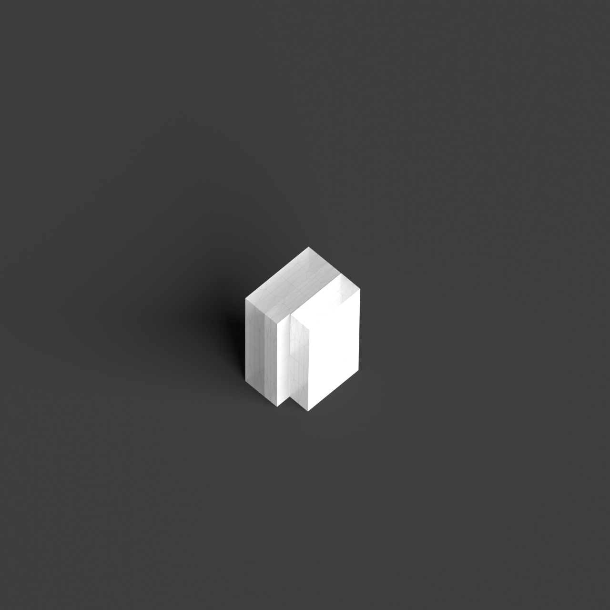
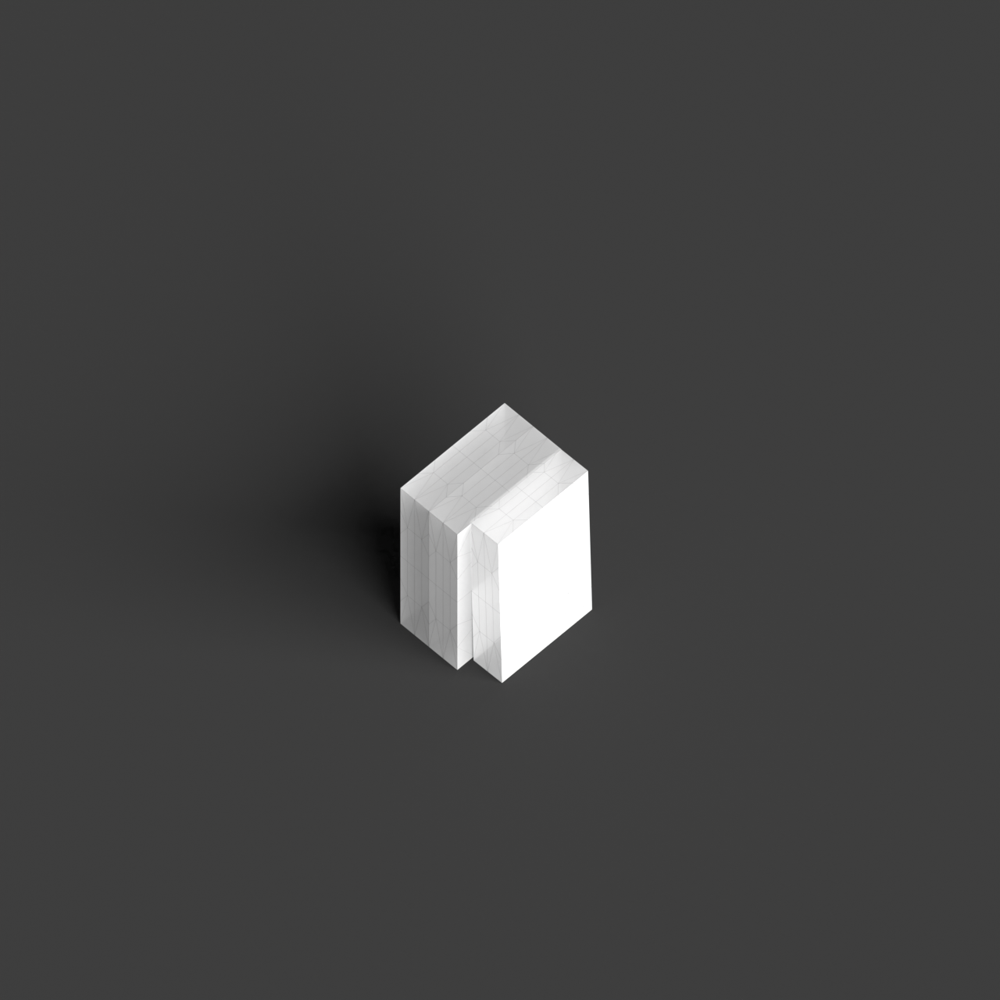

# 0013_0002_0003_split_void  
         
## Interpretation  
  
### Implications_form :  
The &#x27;Split void&#x27; metaphor implies a building form where the central void acts as a dynamic separator, not only dividing the structure but also introducing an interplay of light and shadow that enriches the spatial experience. The void might manifest as a vertical or horizontal split, influencing the building&#x27;s overall geometry and silhouette with a striking formal division. This separation creates a dialogue between the two halves, which could be characterized by differing heights, orientations, or functions, thereby enhancing the sense of duality. The spatial relationships are defined by the void&#x27;s ability to generate diverse pathways and visual corridors, promoting movement and interaction across the divide while maintaining a cohesive architectural identity.  
### Metaphor :  
Split void  
### Key_traits :  
The metaphor &#x27;Split void&#x27; implies a design characterized by a clear division or separation within a central open space. This can create a dynamic tension and a sense of duality or contrast within the architecture, allowing for varied interactions with light and shadow. It suggests the creation of distinct zones or pathways and can evoke feelings of openness and movement while maintaining a strong formal identity.  
### Design_task :  
Develop an Architectural Concept Model that captures the essence of the &#x27;Split void&#x27; metaphor by focusing on the interplay of divided spaces. Design a structure where the void serves as a pivotal element that both separates and connects the building&#x27;s components. Experiment with varying heights or levels on either side of the void, and explore how these variations influence the perception of space and the flow of movement. Use the void as a conduit for natural light, creating shifting patterns and contrasts that highlight the division. The model should articulate the duality of the spaces, perhaps through the use of different textures or forms, while ensuring that the void itself becomes an integral, unifying feature of the design.  
## Agent summary :  
The function `create_split_void_concept_model` generates an architectural concept model based on the &#x27;Split void&#x27; metaphor by creating two distinct building sections separated by a central void. It takes parameters for dimensions and heights, allowing for dynamic variations in the structure. The left and right sections are represented by boxes, with the void acting as a pivotal element that fosters light interaction and spatial flow. By manipulating the geometry such as applying slight rotations to the right section the model captures the essence of duality, promoting movement and visual dialogue while maintaining a cohesive architectural identity.