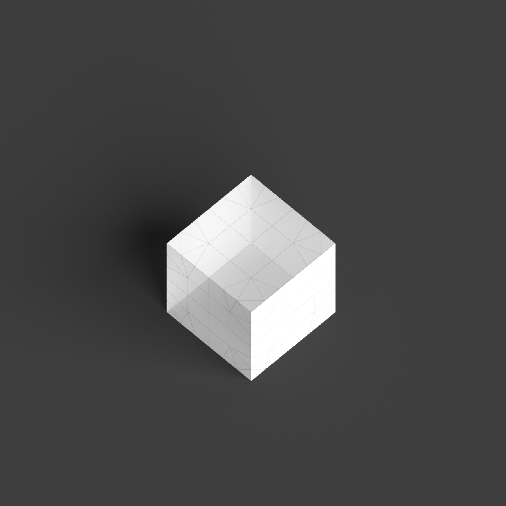

# 0014_0003_0005_porous_fractured_monolith  
         
## Interpretation  
  
### Implications_form :  
The metaphor &#x27;Porous fractured monolith&#x27; influences the building&#x27;s Form &amp; Massing by introducing a substantial, unified mass that is interrupted by irregular voids and fissures, creating a striking contrast between solidity and openness. This form suggests a robust silhouette that is visually compelling and complex, with the fractures adding a sense of movement and tension. Spatially, the metaphor informs an arrangement where the voids serve as conduits for visual and physical connections, linking interior and exterior spaces fluidly. These gaps facilitate natural light penetration and airflow, enhancing environmental interaction. The fractured nature of the design suggests an organic, evolving layout where spaces are discovered rather than linear, promoting exploration and interaction within the building. The arrangement supports a dynamic relationship between private and communal areas, with the voids acting as transitional zones that encourage engagement.  
### Metaphor :  
Porous fractured monolith  
### Key_traits :  
The metaphor &#x27;Porous fractured monolith&#x27; suggests a design that combines the solidity and singularity of a monolithic form with a sense of permeability and fragmentation. The key traits include a strong, unified mass that is visually and structurally significant, yet it is punctuated by voids or gaps that create a sense of lightness and openness. This duality allows for dynamic interaction between interior and exterior spaces, promoting natural ventilation and light penetration. The fractured aspect implies a deliberate, irregular division or disruption in the form, introducing complexity and a sense of movement or tension within the solid structure. The porous quality invites connectivity, fostering interaction and engagement between different spatial zones.  
### Design_task :  
Develop an Architectural Concept Model for the &#x27;Porous fractured monolith&#x27; by starting with a single, cohesive mass that represents the monolithic form. Introduce a series of irregular fissures and openings to convey the fractured aspect, ensuring these are varied in shape and direction to evoke a sense of movement and complexity. Use a combination of solid and translucent materials to highlight the contrast between mass and void, with the translucent elements emphasizing the permeability and lightness of the voids. Focus on how these fractures influence the flow of spaces and light within the model, and how they create a sense of discovery and interaction. The model should capture the tension between the solid monolithic form and the dynamic voids, illustrating a harmonious balance between strength and openness, and inviting curiosity and exploration.  
## Agent summary :  
The provided function generates an architectural concept model based on the metaphor &quot;Porous fractured monolith.&quot; It starts by creating a solid monolithic form, represented as a box, and then introduces irregular fissures that disrupt this mass, replicating the metaphor&#x27;s essence. These fissures vary in shape and orientation, embodying complexity and movement, while their depth and width can be adjusted for intensity. The model integrates both solid and translucent materials, enhancing the contrast between mass and void, which facilitates natural light and airflow. Ultimately, the design fosters exploration and interaction within the spaces, aligning with the metaphor&#x27;s implications.