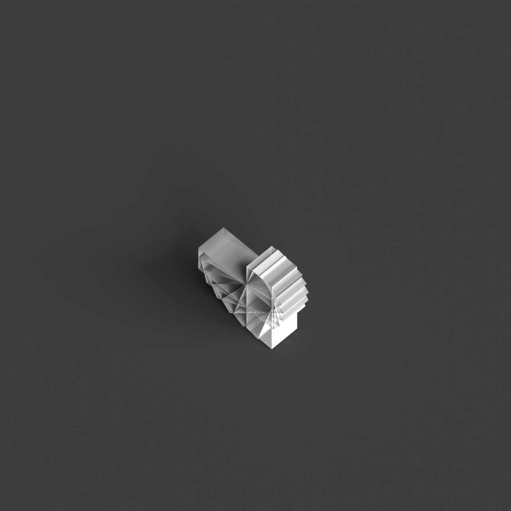
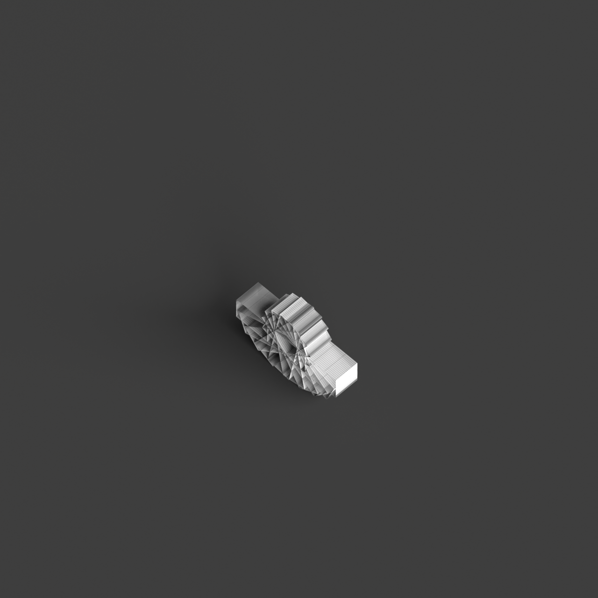
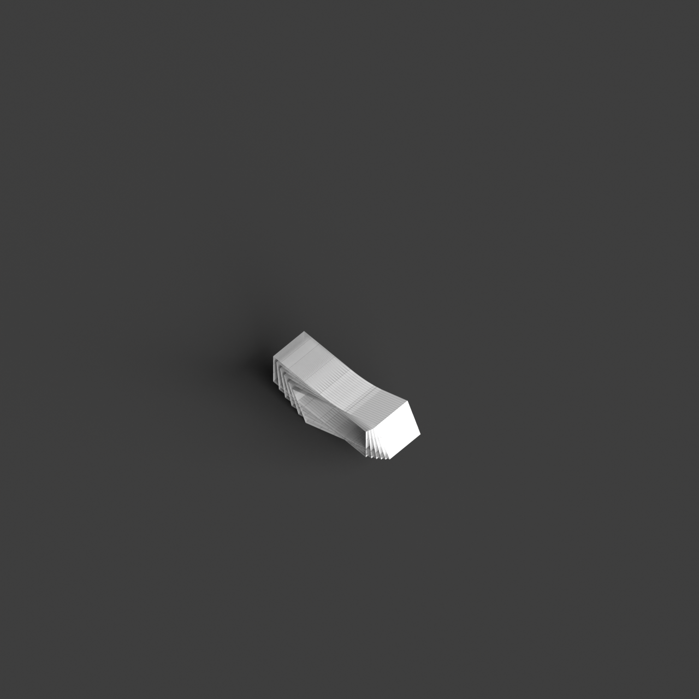
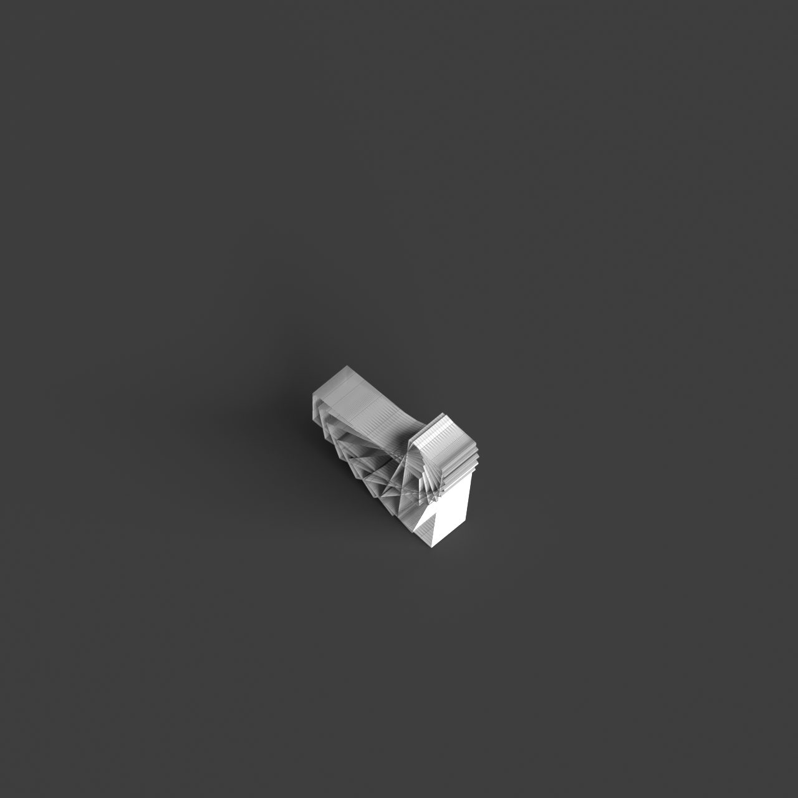
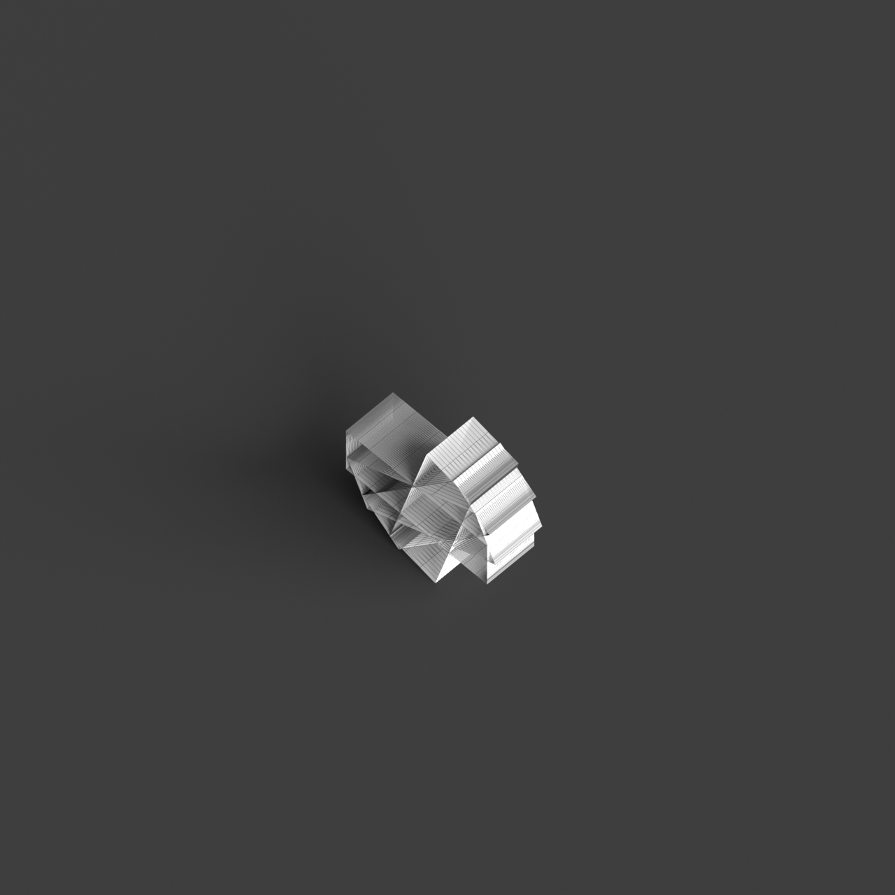

# 0017_0002_0005_cascading_frames  
         
## Interpretation  
  
### Implications_form :  
The metaphor &#x27;Cascading frames&#x27; suggests a building form where structural elements are arranged in a layered sequence that evokes a sense of dynamic progression and continuity. The massing could feature a series of interlocking frames that appear to cascade, creating a rhythmic pattern of repetition and variation. This layered arrangement emphasizes verticality and creates a dynamic silhouette, with frames that might lean or shift to accentuate movement. Spatial relationships are likely organized to allow fluid transitions between spaces, with each frame acting as a threshold that guides the observer&#x27;s journey through the building. The geometry could incorporate angular shifts or rotations, enhancing the perception of movement and creating a visually engaging interplay of light and shadow as sunlight interacts with the varied planes.  
### Metaphor :  
Cascading frames  
### Key_traits :  
This metaphor evokes a sense of dynamic progression and layered depth. It suggests a design where structural elements are organized in successive tiers, creating an interplay of light and shadow. The cascading nature implies fluidity and movement, allowing for visual complexity and spatial continuity. These frames can guide the eye through a sequence of spaces, emphasizing verticality and connectivity within the architecture.  
### Design_task :  
Design an Architectural Concept Model that captures the &#x27;Cascading frames&#x27; metaphor by using a series of interlocking frames, each slightly rotated or shifted to suggest fluidity and dynamic progression. Focus on creating a rhythmic pattern through the repetition of these frames, emphasizing vertical continuity and movement. Utilize varying heights and angles to capture the interplay of light and shadow, enhancing the perception of depth. The model should guide the viewer&#x27;s eye through a sequential journey of interconnected spaces, with each frame serving as a visual and spatial threshold. Explore the use of materials with different opacities or textures to emphasize the dynamic layering and allow for a complex play of light across the surfaces. Consider how these cascading frames could orient the building within its context, highlighting specific views or pathways and reinforcing the metaphor&#x27;s sense of movement and connectivity.  
## Agent summary :  
The provided function generates an architectural concept model based on the metaphor &quot;Cascading frames&quot; by creating a series of interlocking frames that evoke fluidity and dynamic progression. Each frame is defined by parameters such as width, height, rotation, and horizontal shift. The function iteratively constructs frames, applying transformations that rotate and shift each successive frame to suggest movement and continuity. This design approach emphasizes verticality and creates a rhythmic pattern, allowing for an engaging interplay of light and shadow. Ultimately, the generated model captures the essence of the metaphor, guiding the observer through a sequential spatial experience.