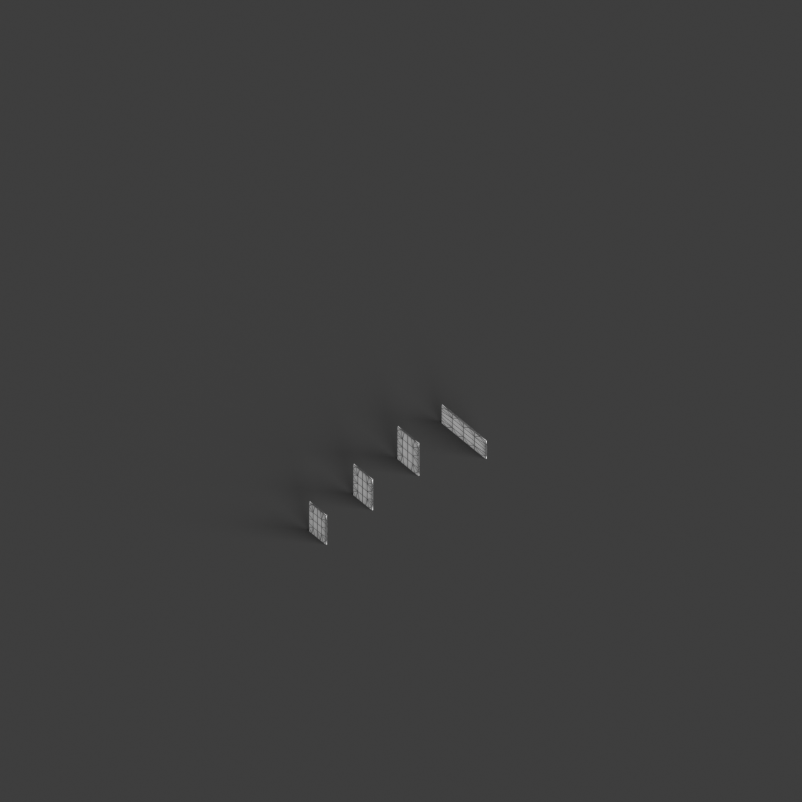

# 0017_0004_0003_cascading_frames  
         
## Interpretation  
  
### Implications_form :  
The metaphor &#x27;Cascading frames&#x27; suggests a building design characterized by a series of interconnected frames that follow a descending or ascending pattern, creating a dynamic and layered silhouette. The massing could involve a sequence of frames that vary in scale and orientation to create an architectural rhythm and emphasize vertical movement. This arrangement allows for a play of light and shadows, as each frame interacts with the others, enhancing the perception of depth and fluidity. Spatial relationships are defined by a continuous flow between the tiers, guiding the observer through a narrative of connected spaces that emphasize both vertical and horizontal connectivity. The geometry may incorporate stepped or cantilevered elements that project outwards, reinforcing the cascading effect and creating a dramatic visual impact.  
### Metaphor :  
Cascading frames  
### Key_traits :  
This metaphor evokes a sense of dynamic progression and layered depth. It suggests a design where structural elements are organized in successive tiers, creating an interplay of light and shadow. The cascading nature implies fluidity and movement, allowing for visual complexity and spatial continuity. These frames can guide the eye through a sequence of spaces, emphasizing verticality and connectivity within the architecture.  
### Design_task :  
Design an Architectural Concept Model that embodies the &#x27;Cascading frames&#x27; metaphor by utilizing a series of frames that progressively shift in scale and orientation to create a rhythmic and dynamic form. Emphasize the interplay of light and shadow by incorporating translucent or perforated materials that allow light to filter through the layers, casting intricate patterns. Focus on creating a fluid transition between different levels, with each frame serving as a visual and spatial connector. Consider how the cascading arrangement can create sheltered outdoor spaces or terraces, enhancing the building&#x27;s interaction with its surroundings. Explore the potential for these frames to guide movement within the building, with pathways and circulation routes integrated into the cascading structure to reinforce the sense of continuity and progression.  
## Agent summary :  
The provided function, `create_cascading_frames`, generates an architectural concept model that embodies the metaphor of &quot;Cascading frames.&quot; It constructs a series of interconnected frames that progressively shift in scale and orientation, creating a dynamic architectural form. Each frame&#x27;s dimensions are adjusted to emphasize vertical movement and spatial continuity, allowing for a rich interplay of light and shadow, as described in the design task. The function systematically creates rectangular frames and uses geometric operations to define their surfaces, ensuring that the resultant structure visually represents a rhythmic flow, guiding observers through a narrative of connected spaces while enhancing outdoor interactions.