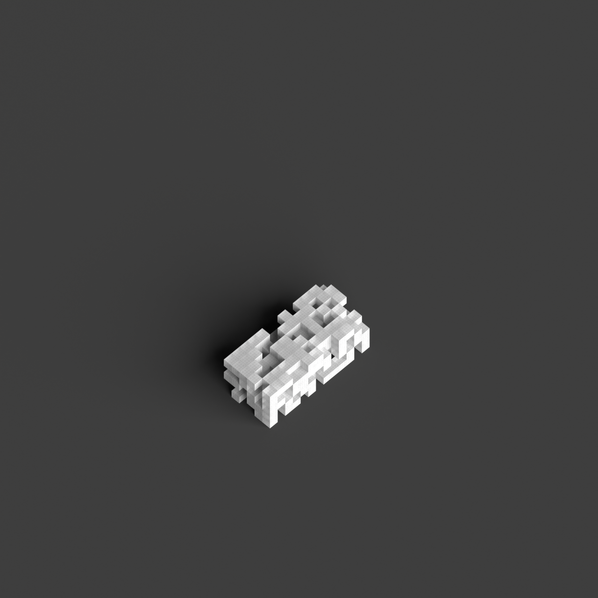
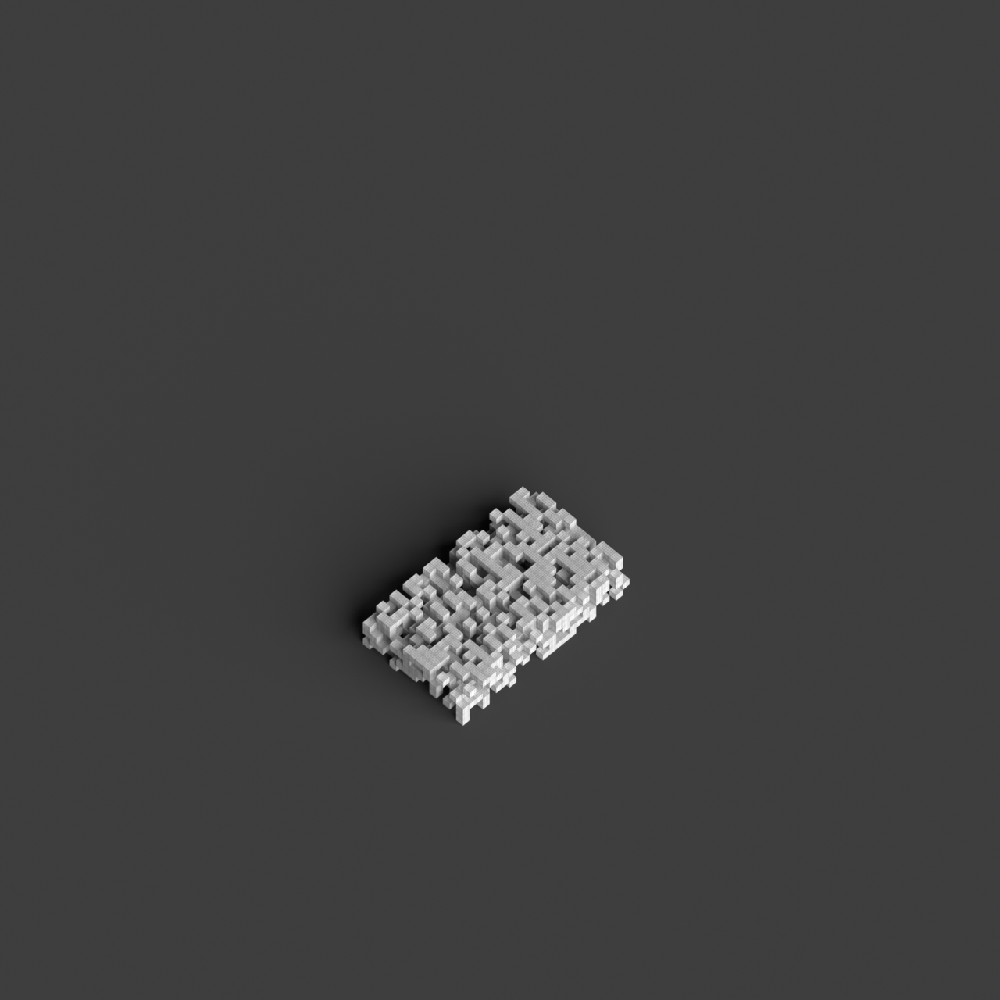
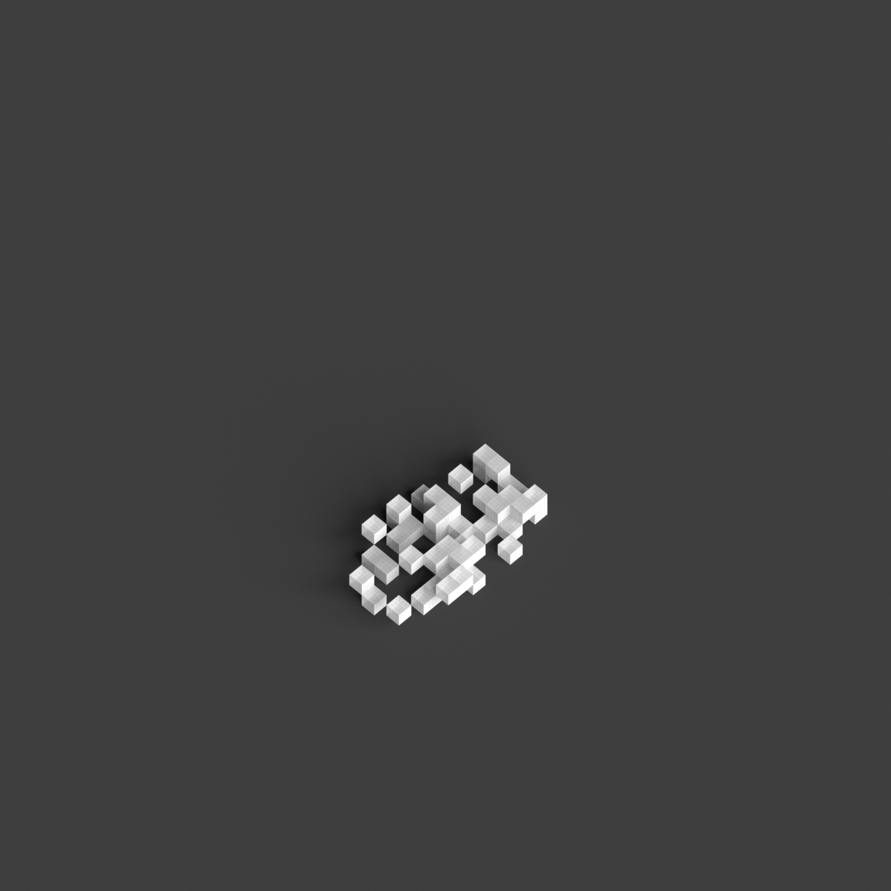
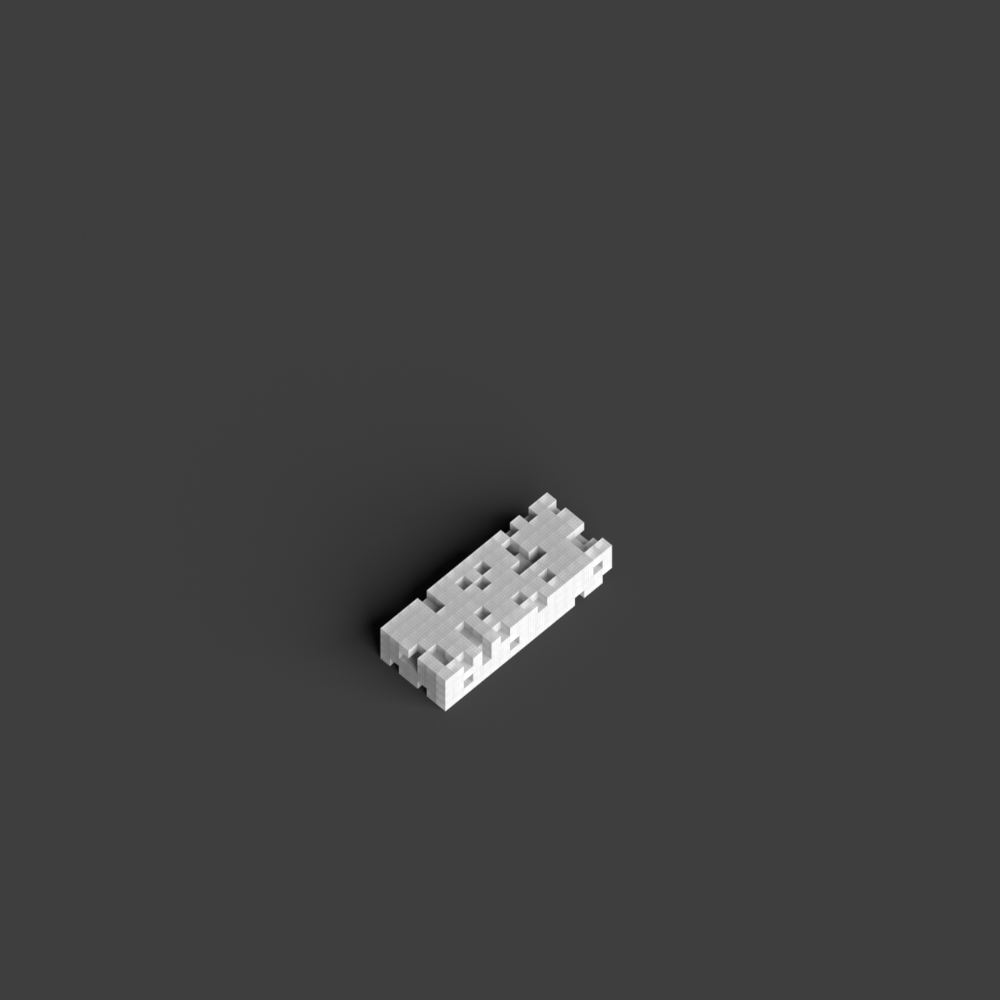

# 0018_0004_0005_perforated_vertical_landscape  
         
## Interpretation  
  
### Implications_form :  
The &#x27;Perforated vertical landscape&#x27; metaphor inspires a building form that integrates verticality with a lattice-like structure, where the interplay of solid and void creates a sense of openness and connectivity. The design suggests a vertical grid or mesh that allows light and air to flow freely, reminiscent of a natural lattice or trellis. This approach shapes spatial relationships by encouraging interaction between interior and exterior spaces, creating an environment that feels both protected and connected to its surroundings. The silhouette might evoke a woven or interlaced pattern, with perforations that serve as conduits for light and air, enhancing the building&#x27;s integration with its environment.  
### Metaphor :  
Perforated vertical landscape  
### Key_traits :  
This metaphor suggests a design that integrates verticality with porous elements, creating a structure that allows light, air, and views to penetrate through its form. It implies a rhythmic interplay between solid and void, offering dynamic visual and spatial experiences. The design can evoke the sense of a natural landscape, reimagined in a vertical orientation, where perforations serve as pathways for interaction between interior and exterior environments.  
### Design_task :  
To represent the &#x27;Perforated vertical landscape&#x27; metaphor, construct an Architectural Concept Model that features a vertical grid or mesh structure. Use materials that allow transparency and permeability, such as wireframe or translucent mesh. Design the model to highlight the interlacing of solid and void, creating a pattern that evokes a natural lattice. Focus on the spatial interaction between interior and exterior, designing pathways or openings that guide light and air through the structure. Emphasize the verticality and openness of the model by varying the density and arrangement of the grid, ensuring it conveys the metaphor&#x27;s essence of a vertical landscape reimagined through a permeable structure.  
## Agent summary :  
The function `create_perforated_vertical_landscape` generates an architectural concept model inspired by the &quot;Perforated vertical landscape&quot; metaphor. It constructs a 3D grid structure, varying the density of solid and void elements based on the specified `void_ratio`. The resulting model features cuboid forms that mimic a lattice, emphasizing verticality and permeability. By adjusting parameters like height, width, depth, and grid size, the function creates diverse spatial configurations that promote light and air flow, fostering interaction between interior and exterior spaces. This design embodies the metaphor&#x27;s essence, integrating natural elements into a cohesive architectural framework.