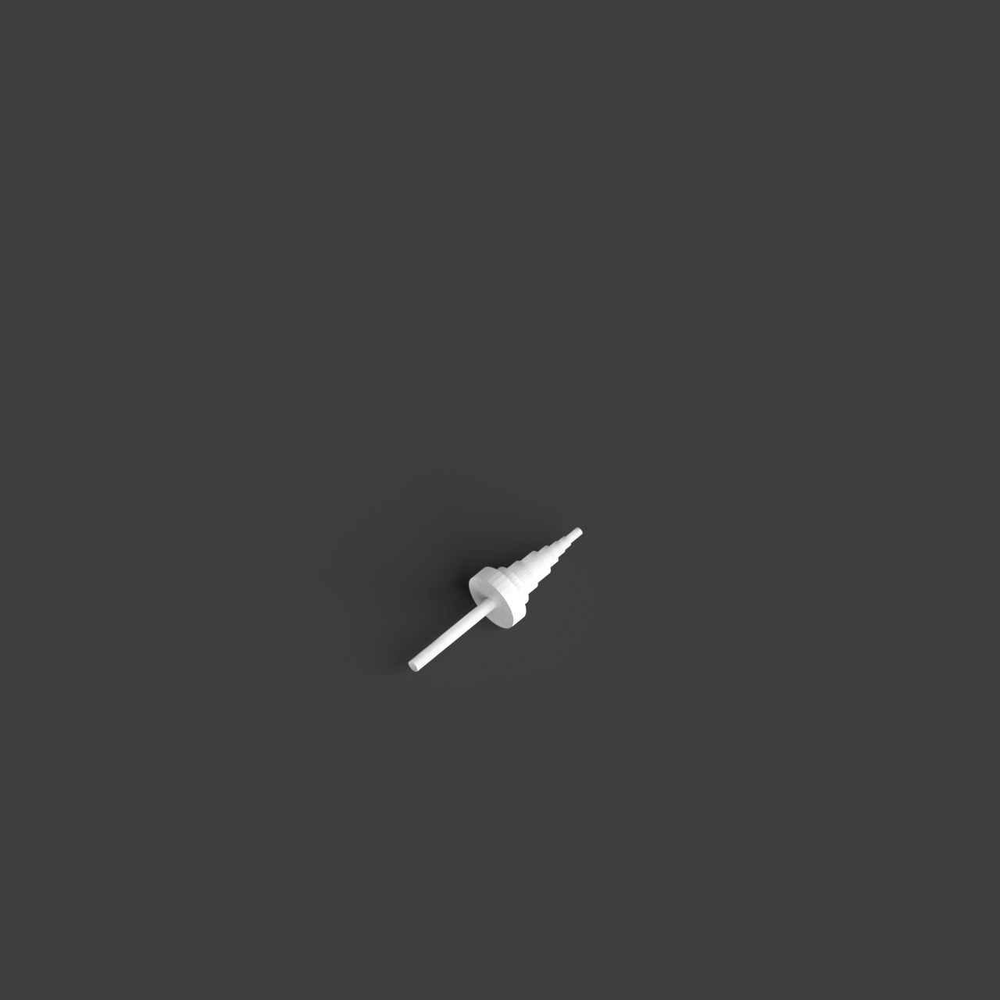
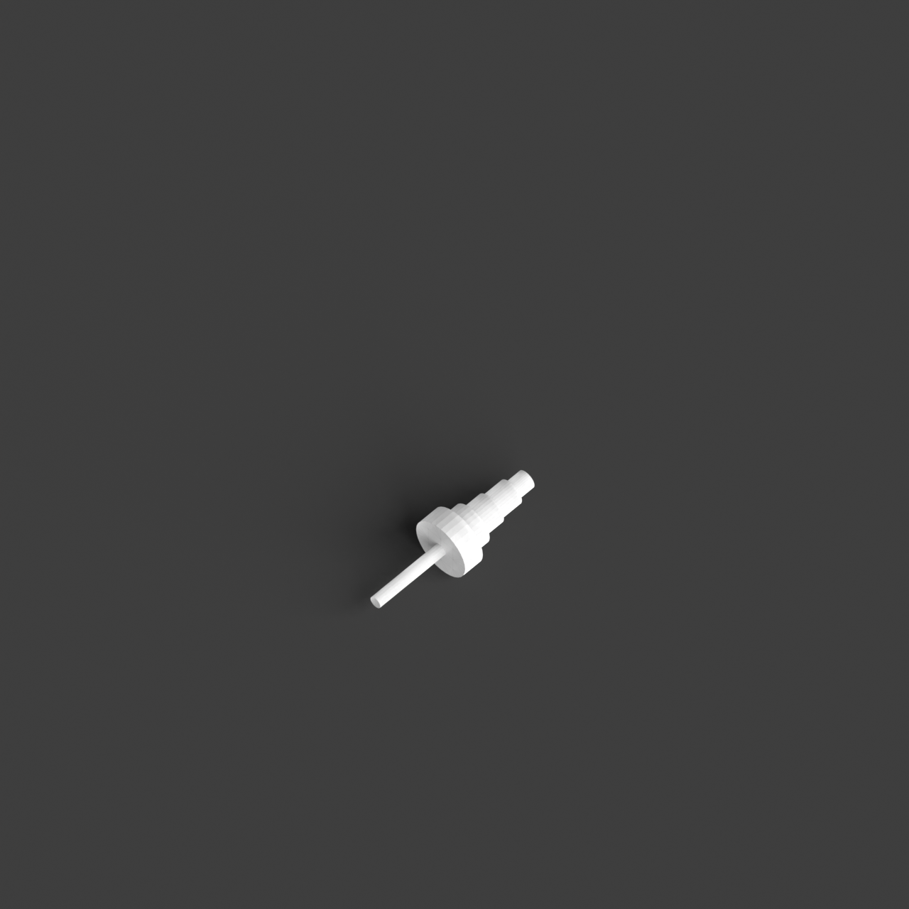
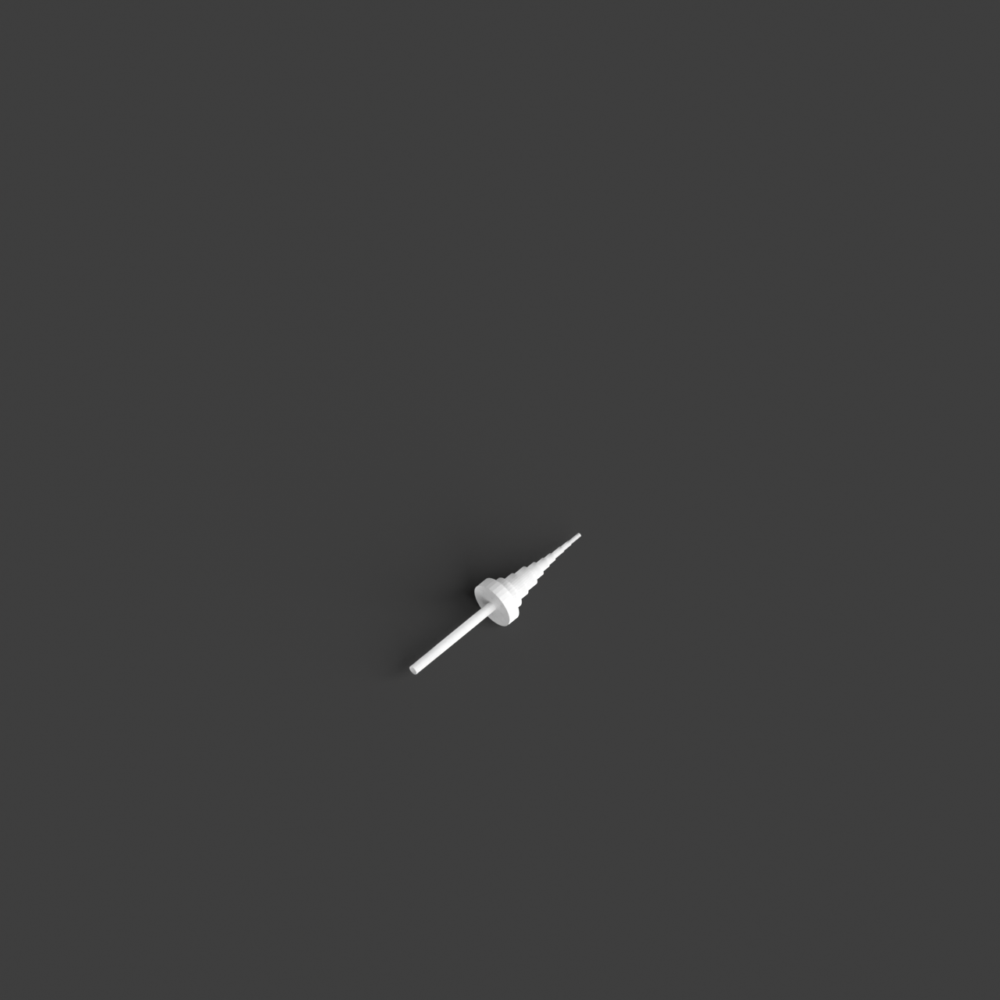
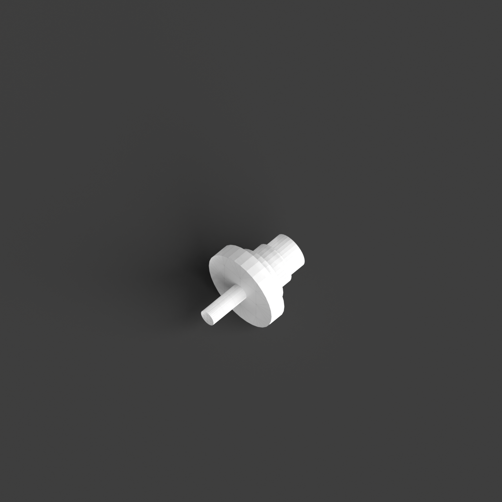

# 0019_0002_0005_subterranean_cavern  
         
## Interpretation  
  
### Implications_form :  
The metaphor of a subterranean cavern implies a building form that is embedded into the landscape with an emphasis on vertical layering, creating a sense of depth and immersion. The geometry might incorporate a series of stepped or tiered platforms that descend into the earth, capturing the stratified nature of a cave. This design approach suggests spatial relationships that prioritize vertical movement and transitions between different levels, evoking a journey into the depths. Spaces could be organized around a central void or atrium that acts as a focal point, reminiscent of a cavern&#x27;s central chamber, with pathways that spiral or meander around this core, enhancing the sense of exploration and mystery. The use of textured surfaces and shadows would further emphasize the natural, raw character associated with a subterranean environment.  
### Metaphor :  
subterranean cavern  
### Key_traits :  
The metaphor of a subterranean cavern conveys a sense of exploration, mystery, and refuge. It suggests a design that is immersive and enveloping, with a focus on creating intimate, sheltered spaces. The architecture might incorporate organic forms, use of natural materials, and varied lighting conditions to evoke the feeling of being in a natural, secluded environment.  
### Design_task :  
Develop an Architectural Concept Model that evokes the &#x27;subterranean cavern&#x27; metaphor by using stacked layers of different materials with varied textures to represent the stratification and depth of a cavern. Focus on creating a central void or atrium within the model, around which spaces are organized in a spiraling or cascading manner. Experiment with vertical transitions and varied ceiling heights to enhance the immersive experience of descending into a cavern. Use contrasting materials or lighting techniques to highlight the interplay of light and shadow across surfaces, emphasizing the organic and mysterious qualities of the design. Aim to capture the essence of exploration and refuge by balancing open and enclosed spaces in the model.  
## Agent summary :  
The function `create_subterranean_cavern_model` generates an architectural concept model inspired by the metaphor of a subterranean cavern. It creates a series of vertically stacked layers that mimic the stratification of a cavern, descending into the ground around a central atrium. Each layer features varied heights and decreasing radii to evoke a spiraling descent, enhancing the immersive experience. The use of random height variations and textures reflects the organic qualities of natural caves, emphasizing exploration and mystery. Ultimately, the model captures a balance of open and enclosed spaces, embodying the essence of refuge and the natural environment.