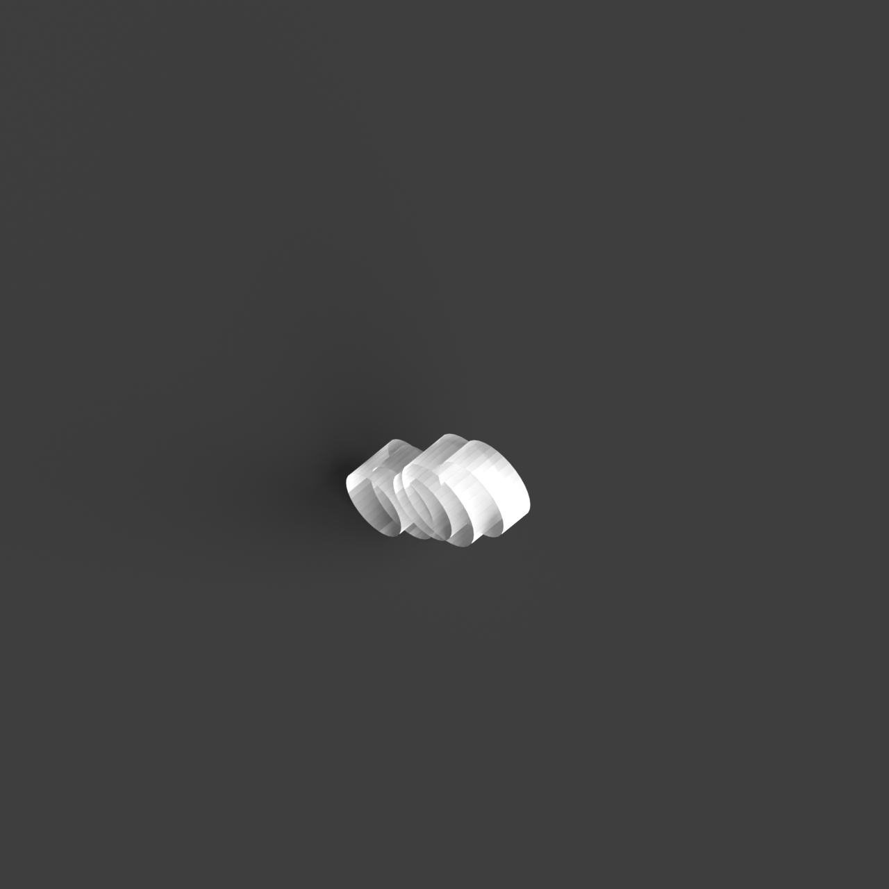
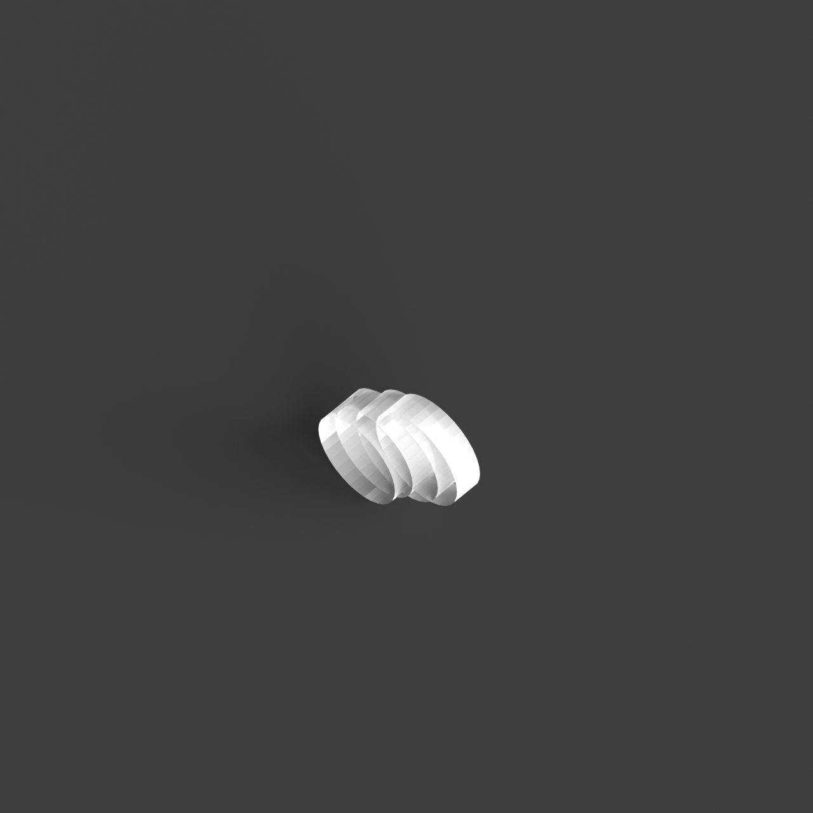

# 0019_0003_0005_subterranean_cavern  
         
## Interpretation  
  
### Implications_form :  
The metaphor of a subterranean cavern suggests a building form that is both hidden and revealed, emphasizing the interplay between concealment and discovery. The massing might feature a low-profile exterior that blends seamlessly with the surrounding landscape, while the interior opens into a series of expansive, interconnected volumes that contrast with the understated exterior. Geometry could include organic, flowing lines and asymmetrical forms that mimic the irregularity of natural cave formations. Spatial relationships would focus on creating a journey of revelation, with spaces unfolding sequentially to offer surprises and moments of awe. The juxtaposition of small, enclosed rooms with large, open chambers would enhance the sense of exploration and refuge, while the use of natural materials and textures would reinforce the connection to the earth.  
### Metaphor :  
subterranean cavern  
### Key_traits :  
The metaphor of a subterranean cavern conveys a sense of exploration, mystery, and refuge. It suggests a design that is immersive and enveloping, with a focus on creating intimate, sheltered spaces. The architecture might incorporate organic forms, use of natural materials, and varied lighting conditions to evoke the feeling of being in a natural, secluded environment.  
### Design_task :  
Construct an Architectural Concept Model that captures the &#x27;subterranean cavern&#x27; metaphor by using a combination of smooth and rough materials to represent the hidden and revealed aspects of the design. Focus on creating a low-profile exterior that suggests concealment, while developing a complex interior with interconnected volumes that unfold sequentially. Use irregular shapes and flowing forms to mimic the natural geometry of caves. Incorporate materials with varied textures to evoke the raw, organic quality of a cavern, and experiment with lighting techniques to simulate the transition from darkness to light as one moves through the space. Aim to balance intimacy and openness, creating a sense of discovery and refuge that reflects the immersive experience of exploring a natural cavern.  
## Agent summary :  
The function `create_subterranean_cavern_model` generates an architectural concept model inspired by the metaphor of a subterranean cavern. It creates interconnected volumes resembling natural chambers by utilizing randomized parameters such as base radius and height variation, which mimic organic forms found in nature. The low-profile base blends with the landscape, while the varied heights and shapes of the chambers enhance the sense of concealment and discovery. By incorporating flowing lines and undulating surfaces, the model reflects the cavern&#x27;s mystery and refuge, while the use of materials with different textures reinforces the connection to the earth, simulating an immersive experience.