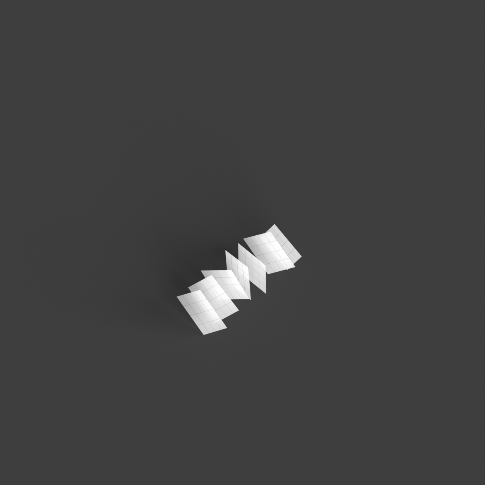
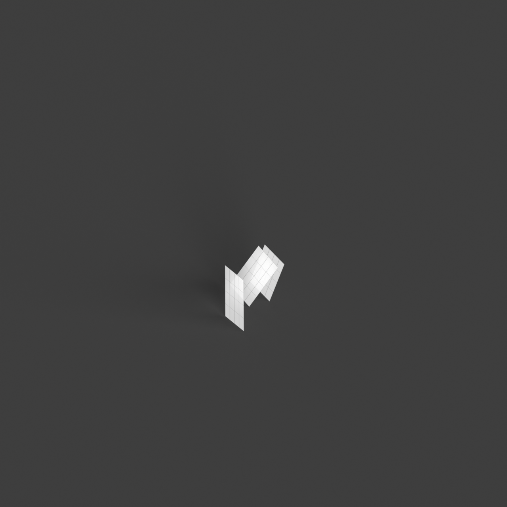

# 0020_0001_0005_stacked_forests  
         
## Interpretation  
  
### Implications_form :  
The metaphor of &#x27;Stacked forests&#x27; shapes the building&#x27;s form and massing by suggesting a vertical layering of volumes that mimic the dense and tiered organization of a forest. This involves creating a series of interconnected platforms or terraces that rise up, each representing a &#x27;layer&#x27; with varying sizes and orientations, akin to the canopy, understory, and forest floor. Spatial relationships are defined by vertical connectivity, with pathways, ramps, and staircases weaving through the layers, offering diverse experiences akin to moving through different forest strata. The geometry emphasizes organic forms, curves, and irregularities to evoke the natural growth patterns of trees, while the silhouette is dynamic and varied, resembling a skyline of treetops.  
### Metaphor :  
Stacked forests  
### Key_traits :  
This metaphor suggests a multi-layered, vertical organization resembling a dense, tiered forest. The design would emphasize a sense of hierarchy, depth, and organic growth. It encourages the integration of natural elements, creating spatial richness with varied levels of interaction. The structure would embody vertical connectivity, offering a diverse range of experiences and pathways, much like the layers found in a natural forest ecosystem.  
### Design_task :  
Create an Architectural Concept Model that embodies the &#x27;Stacked forests&#x27; metaphor by constructing a series of layered platforms or blocks that rise vertically. Each layer should be distinct in form and orientation, yet interconnected by vertical circulation elements like ramps or staircases. Use organic shapes and irregular forms to represent the diverse forest strata. Integrate natural elements such as green terraces or vegetative façades to enhance the forest-like feel. Emphasize a hierarchy in the spatial organization, with each level providing unique interactions and experiences, much like the different layers in a forest ecosystem.  
## Agent summary :  
The function `create_stacked_forests_model` generates an architectural concept model inspired by the &quot;Stacked forests&quot; metaphor. It constructs multiple layers, each resembling forest strata, by creating rectangular bases that vary in size and height. Each layer is positioned at different heights, and random rotations are applied to mimic organic growth. This vertical layering emphasizes connectivity, akin to moving through a forest, and allows for unique spatial interactions. The design incorporates parameters such as base dimensions, layer count, and height variation, resulting in a dynamic structure that reflects the metaphors themes of hierarchy, depth, and organic form.