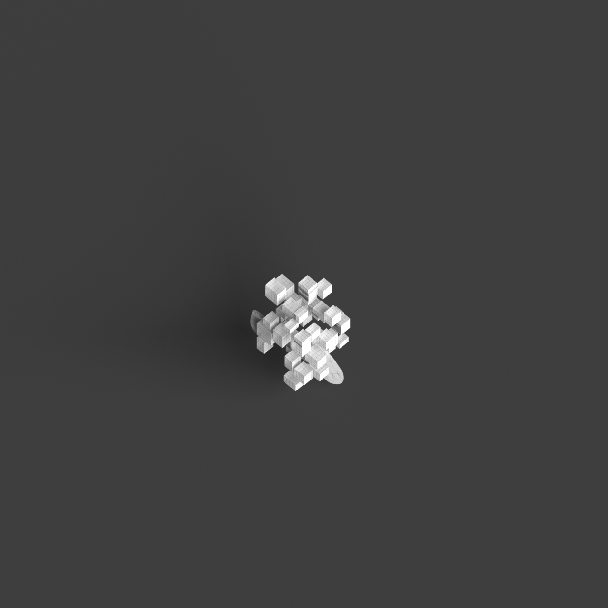
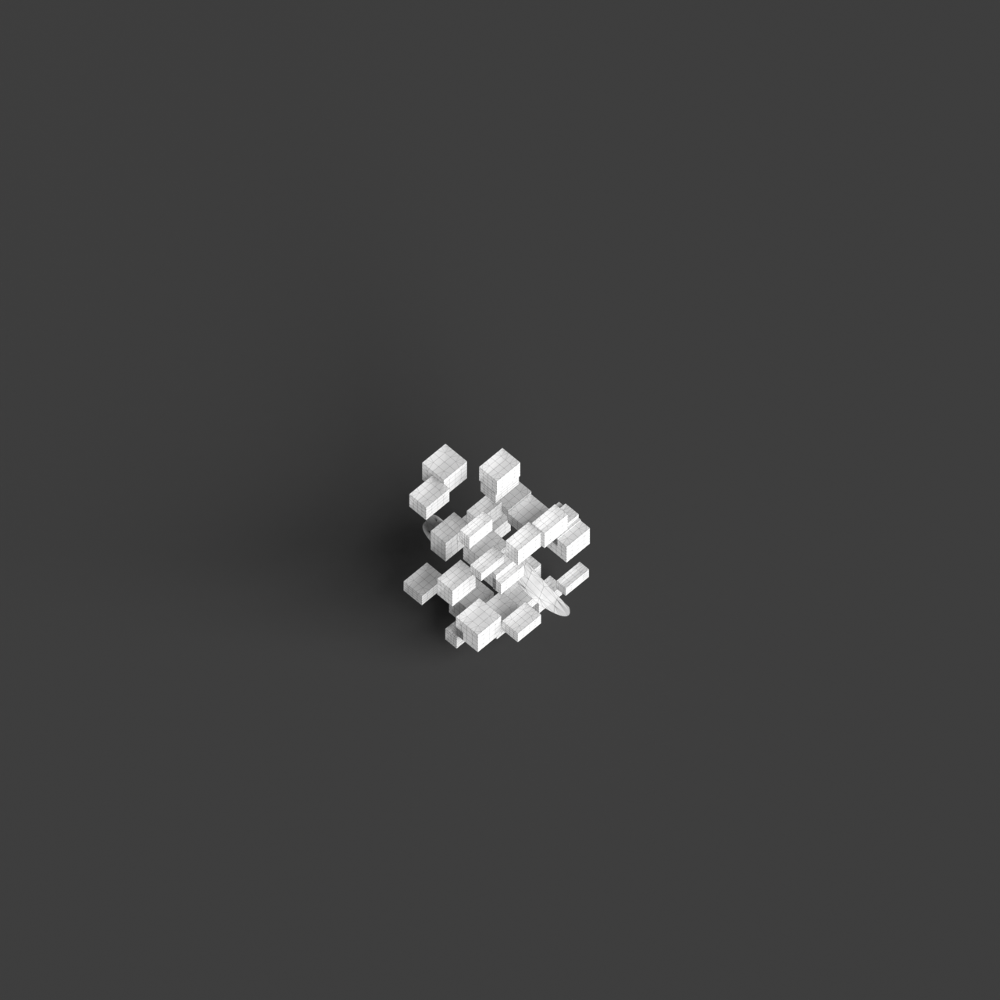
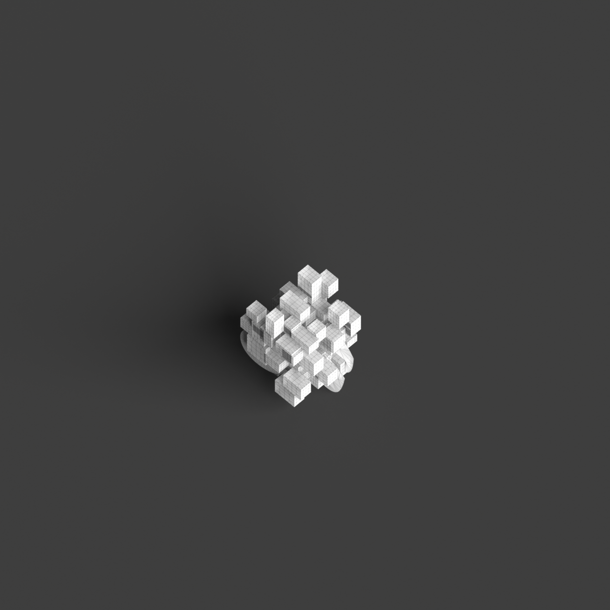
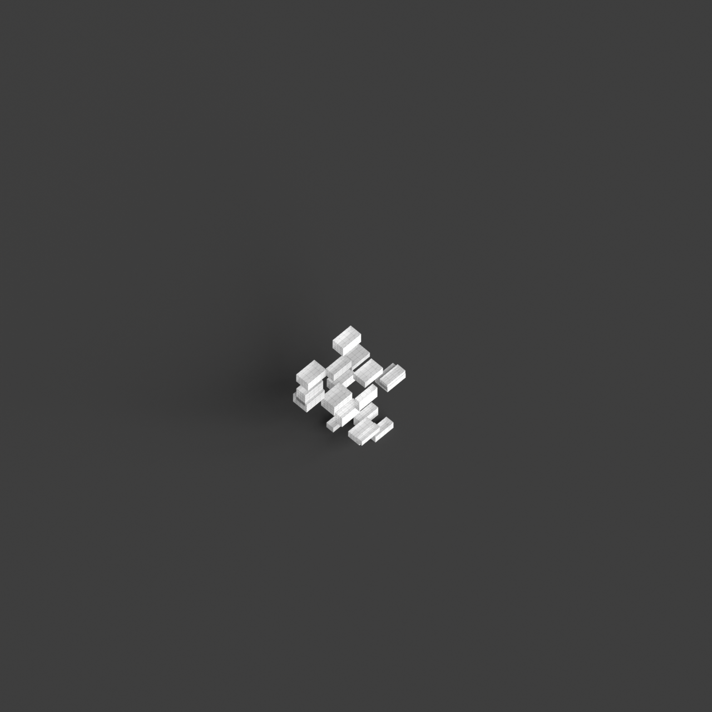

# 0020_0004_0003_stacked_forests  
         
## Interpretation  
  
### Implications_form :  
The metaphor of &#x27;Stacked forests&#x27; influences the building&#x27;s form and massing by proposing a network of vertically and horizontally interwoven elements, suggesting the intertwined roots and branches of a forest. This approach emphasizes a complex matrix of pathways and spaces, where the building grows organically upwards and outwards, much like the spread of a forest canopy. Spatial relationships are characterized by layered intersections, where spaces overlap and converge, fostering a sense of exploration and discovery. The geometry embraces both rectilinear and curvilinear forms to capture the unpredictable yet harmonious nature of a forest, while the silhouette presents a varied and textured profile, echoing the diversity and depth of a natural forest.  
### Metaphor :  
Stacked forests  
### Key_traits :  
This metaphor suggests a multi-layered, vertical organization resembling a dense, tiered forest. The design would emphasize a sense of hierarchy, depth, and organic growth. It encourages the integration of natural elements, creating spatial richness with varied levels of interaction. The structure would embody vertical connectivity, offering a diverse range of experiences and pathways, much like the layers found in a natural forest ecosystem.  
### Design_task :  
Create an Architectural Concept Model that embodies the &#x27;Stacked forests&#x27; metaphor by developing a lattice-like structure composed of interwoven horizontal and vertical elements. Focus on creating a matrix of intersecting forms that symbolize the dense interconnectivity of a forest. Use a combination of rectilinear and organic shapes to evoke the natural complexity and order found in forest ecosystems. Incorporate multiple layers of pathways and spaces, allowing for an intricate network of movement and interaction. Aim for a silhouette that is richly textured and dynamic, capturing the layered and interwoven essence of a forest, with varied heights and depths to suggest diversity and growth.  
## Agent summary :  
The function `create_stacked_forests_concept_model` generates an architectural concept model inspired by the metaphor of &quot;Stacked forests.&quot; It creates a lattice-like structure composed of interwoven horizontal and vertical elements, symbolizing the interconnectedness of a forest. The model incorporates a mix of rectilinear and curvilinear shapes to reflect the organic complexity of forest ecosystems. Each layer features a matrix of intersecting forms that allow for varied spatial interactions, embodying the natural depth and hierarchy of a forest. This results in a dynamic silhouette with diverse heights, evoking the visual richness of layered forest environments.