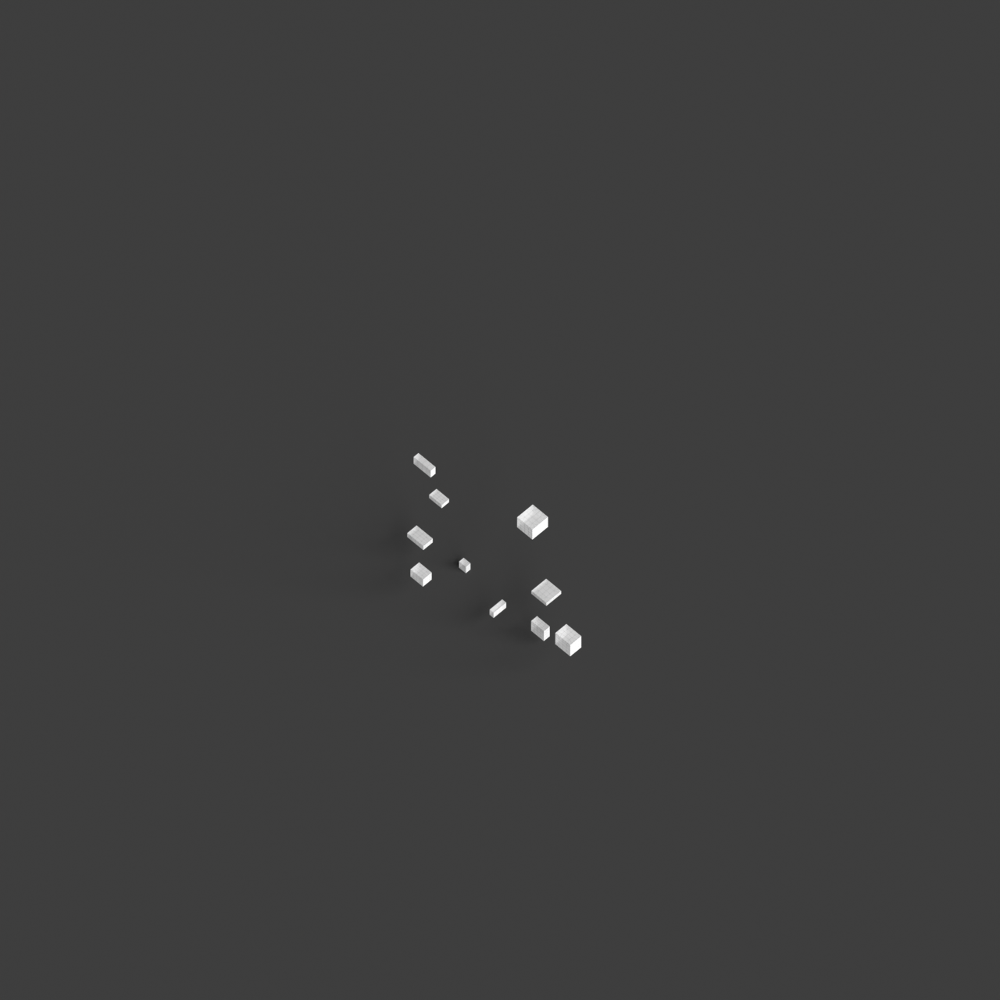
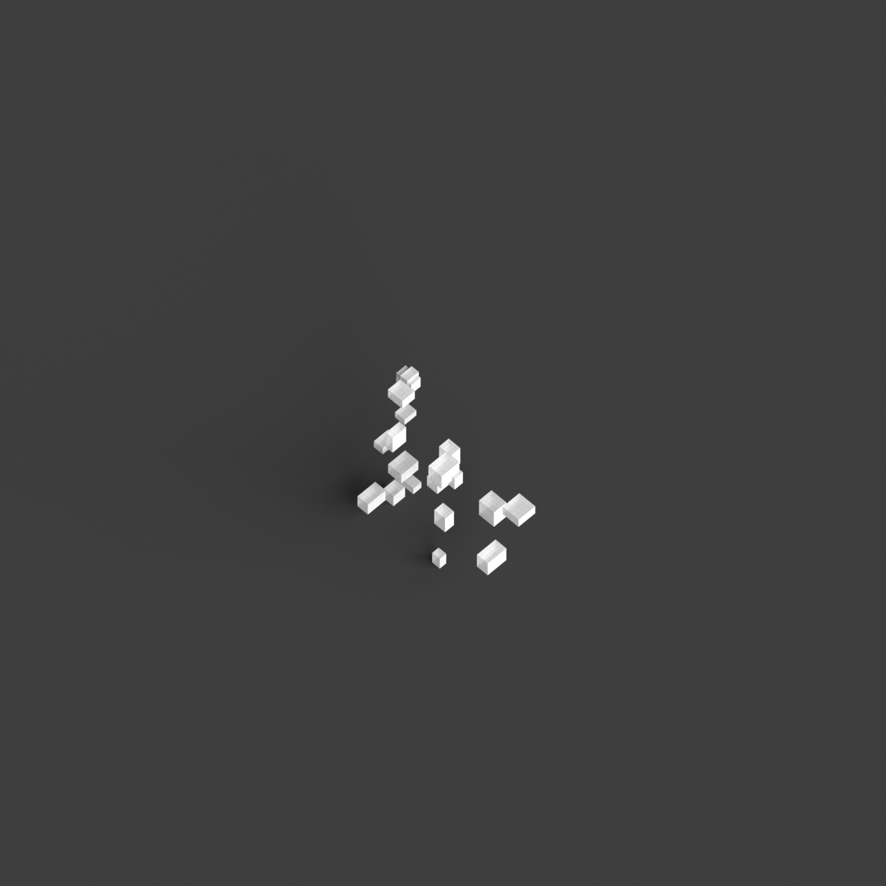
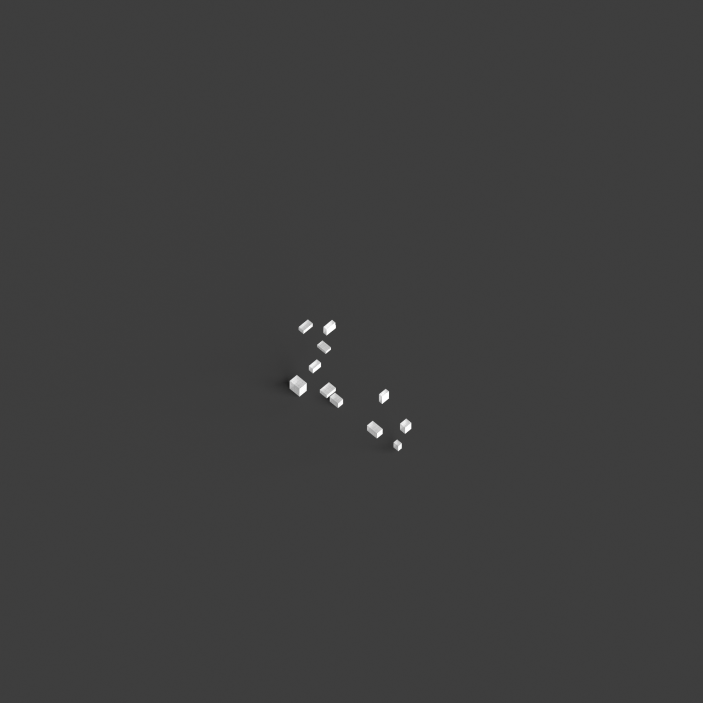
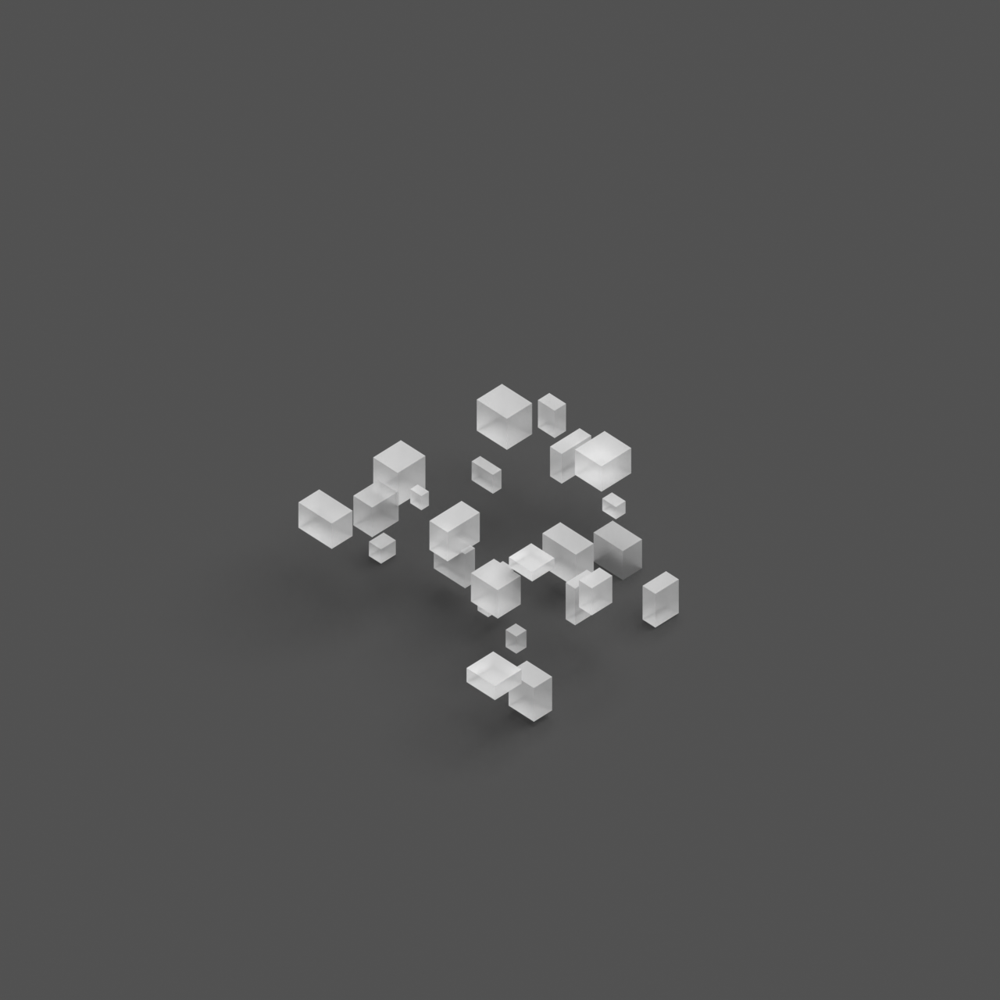

# 0003_0001_0002_a_labyrinth_of_blocks  
         
## Interpretation  
  
### Implications_form :  
The metaphor &#x27;A labyrinth of blocks&#x27; suggests a building form characterized by a seemingly chaotic yet intentionally structured massing. The building&#x27;s geometry would consist of a series of interconnected blocks of varying sizes and heights, creating a fragmented silhouette that evokes a sense of curiosity and exploration. The spatial relationships within the building are non-linear, with pathways that twist and turn, leading to unexpected destinations and creating a dynamic interplay of light and shadow. This arrangement fosters an environment where users are encouraged to explore and engage with the space, discovering hidden corners and unique perspectives.  
### Metaphor :  
A labyrinth of blocks  
### Key_traits :  
This metaphor suggests a complex and intricate spatial configuration. It implies a design that challenges navigation and orientation, creating a sense of mystery and exploration. The arrangement of blocks can vary in height, size, and orientation, introducing unexpected pathways and hidden spaces. The design prioritizes the interplay of light and shadow, varying perspectives, and dynamic circulation routes, encouraging discovery and engagement with the architecture.  
### Design_task :  
To embody the metaphor &#x27;A labyrinth of blocks&#x27; in an Architectural Concept Model, create a composition of modular blocks of varying dimensions and orientations. Utilize a grid system to arrange the blocks, but introduce deliberate disruptions to the grid to simulate the labyrinthine quality. Design circulation paths that weave through the blocks, incorporating nodes or focal points where paths intersect, offering moments of pause and reflection. Employ a play of solid and void, with some blocks acting as enclosed spaces and others as open passages, to enhance the sense of mystery and discovery. Consider the impact of light by varying the heights of the blocks, allowing for shafts of light to penetrate deeper into the labyrinth, creating dynamic shadows and highlighting different areas at various times of the day.  
## Agent summary :  
The function `create_labyrinth_of_blocks` generates an architectural concept model that embodies the metaphor of &quot;a labyrinth of blocks.&quot; It creates a complex spatial arrangement by randomly generating blocks of varying sizes and positions within defined boundaries. The randomization fosters intricate configurations that challenge navigation and orientation, aligning with the metaphor&#x27;s essence of mystery and exploration. Each block&#x27;s height, size, and orientation contribute to diverse perspectives and dynamic circulation routes, enhancing the interplay of light and shadow. The resulting 3D geometries encourage engagement with the architecture, reflecting the complexity implied by the metaphor.