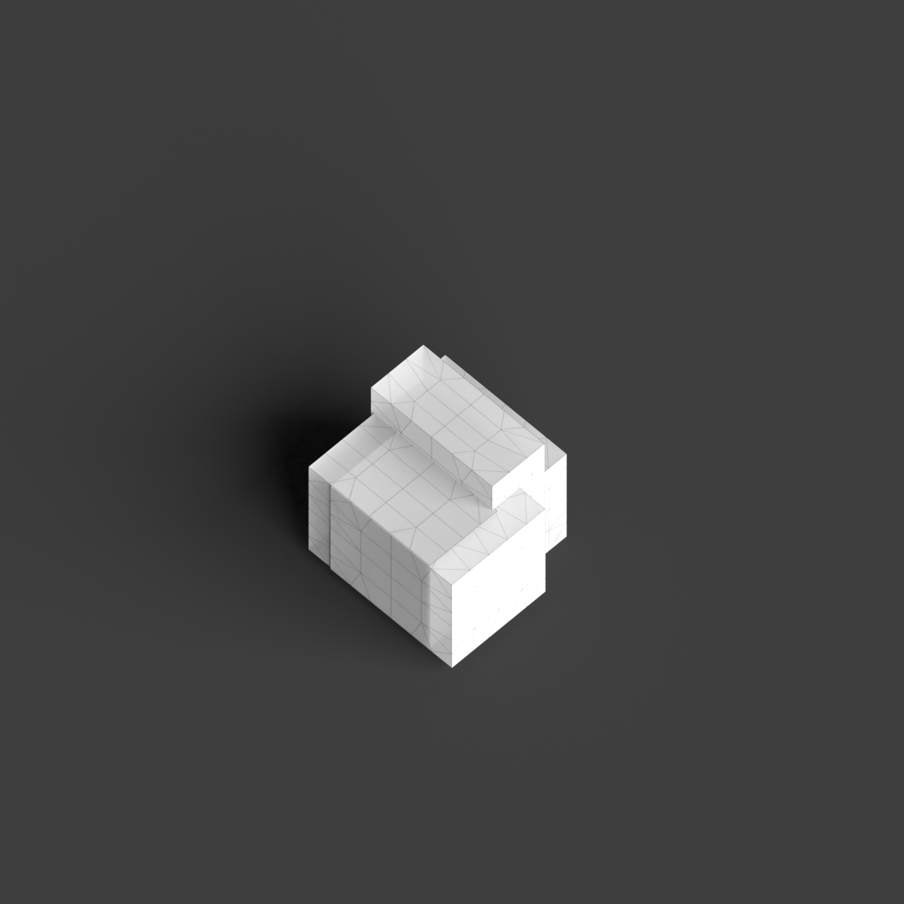
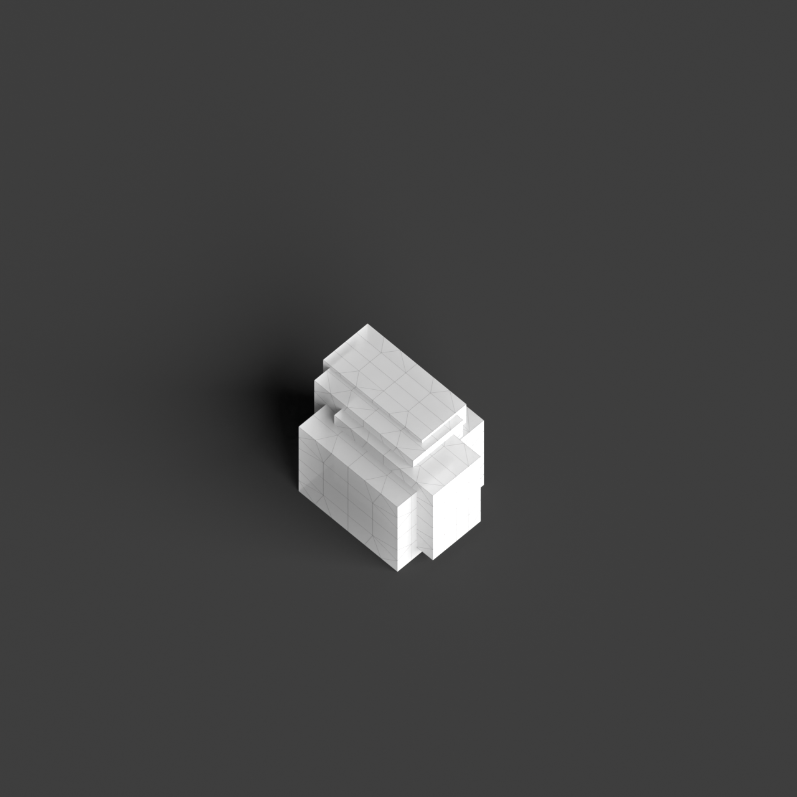
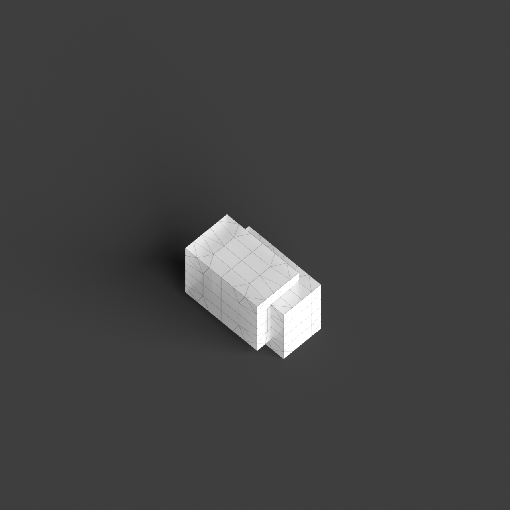
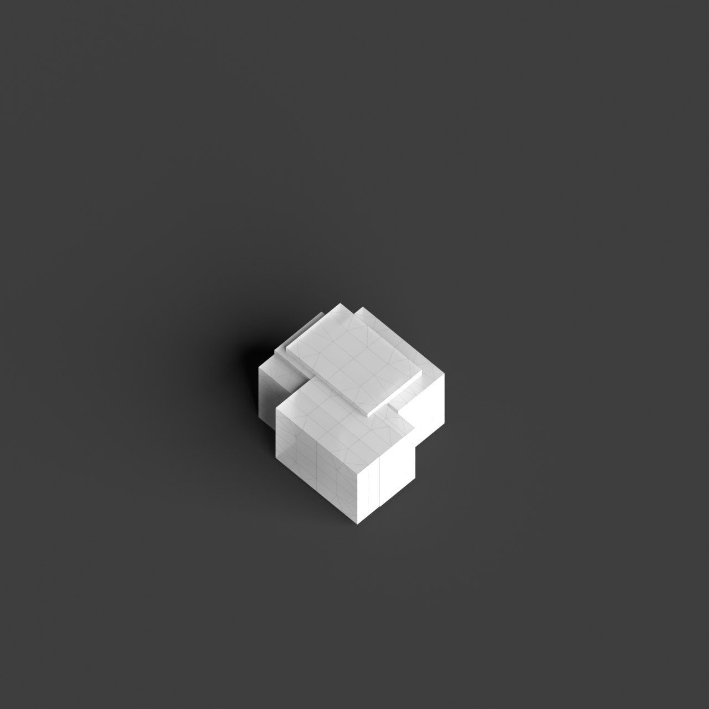
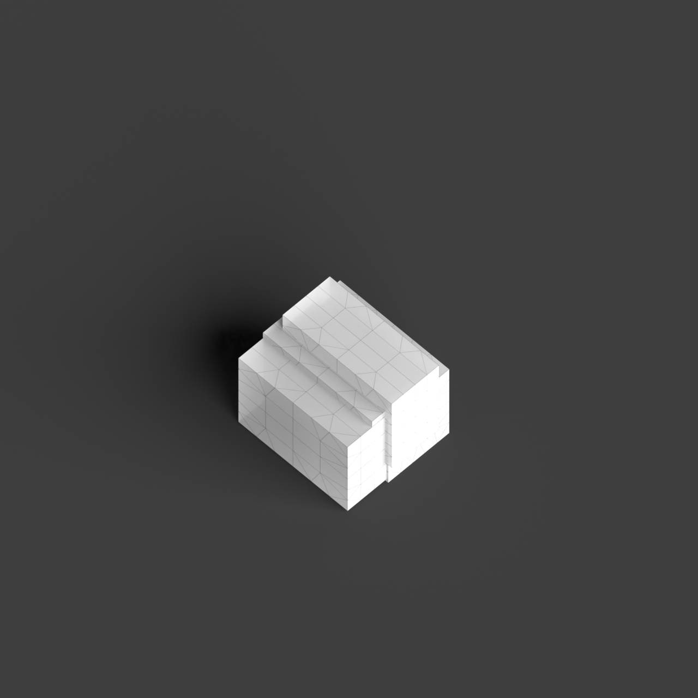

# 0004_0001_0004_interlocking_layers  
         
## Interpretation  
  
### Implications_form :  
The metaphor of &#x27;Interlocking Layers&#x27; suggests a building form characterized by multiple overlapping planes or volumes that interconnect, creating a dynamic and visually complex structure. This approach impacts the massing by providing a sense of depth and movement, as the layers seem to shift and slide over one another. The silhouette of the building would be varied and intricate, with elements protruding and receding. Spatially, the interlocking layers suggest a design where spaces are both distinct and connected, allowing for diverse interactions and transitions between different functional areas. The arrangement of spaces would prioritize both openness and separation, with layers providing privacy where needed while maintaining visual and physical connections.  
### Metaphor :  
Interlocking Layers  
### Key_traits :  
This metaphor suggests a design characterized by overlapping and interconnected planes or volumes. The interlocking nature creates dynamic spatial relationships and visual depth, allowing for both openness and separation within the architecture. It emphasizes a structural and spatial complexity, where different layers interact to provide variety in function and experience.  
### Design_task :  
To embody the &#x27;Interlocking Layers&#x27; metaphor in an Architectural Concept Model, create a series of interconnected planes or volumes that are physically interlocked. Use materials or colors to differentiate each layer, highlighting their individual qualities while showing their integration into a cohesive whole. Focus on contrasting open and closed spaces, demonstrating how the layers create both intimate and expansive environments. Experiment with different orientations and angles for the layers to illustrate the dynamic interplay between them. Ensure the model captures the essence of structural complexity and spatial variety, with layers visibly interacting to create a rich architectural experience.  
## Agent summary :  
The provided function generates an architectural concept model based on the metaphor of &quot;Interlocking Layers.&quot; It creates multiple overlapping layers with varying heights and offsets, reflecting the complexity and dynamism suggested by the metaphor. Each layer is represented as a three-dimensional box, whose dimensions and positions are randomized within specified constraints, ensuring a unique arrangement. This results in interconnected planes that exhibit both visual depth and spatial variety. By adjusting parameters like base dimensions and layer count, the function produces diverse models that embody the principles of openness and separation inherent in the interlocking layers concept.