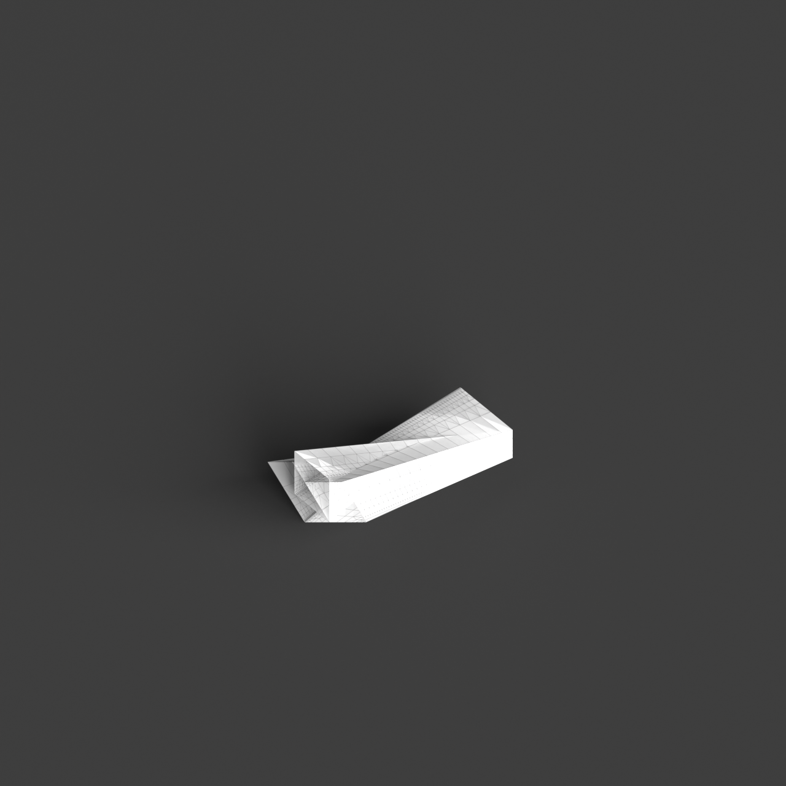
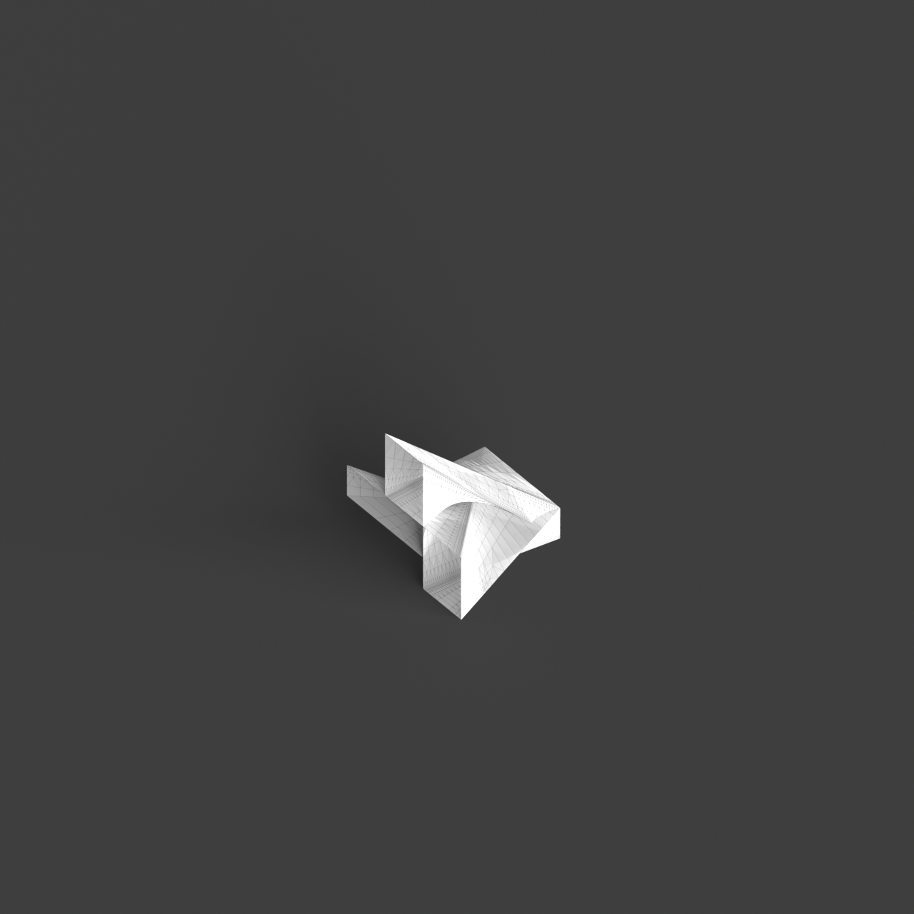
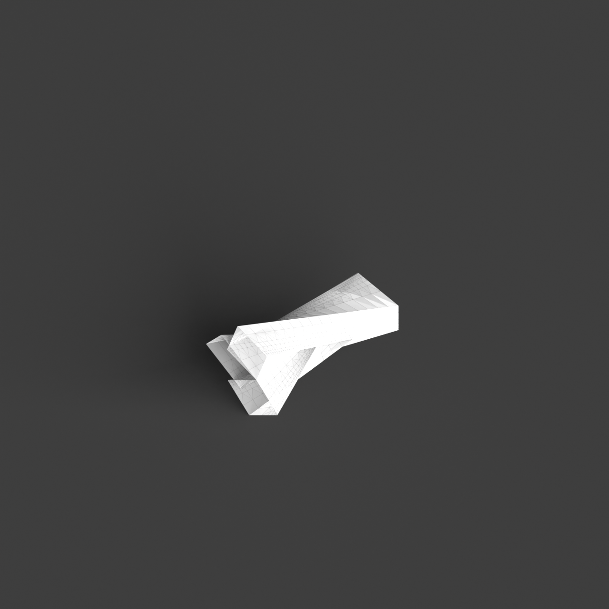
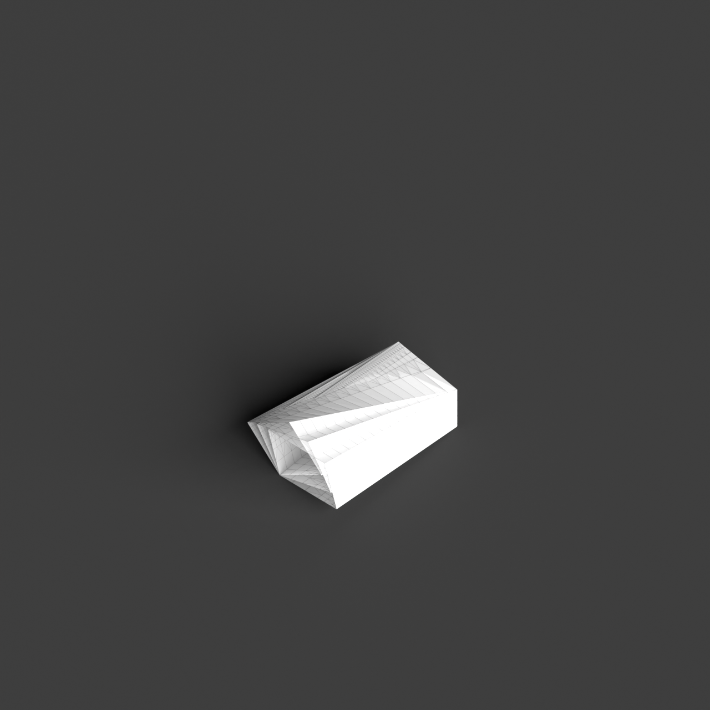

# 0012_0001_0002_twisted_volumes  
         
## Interpretation  
  
### Implications_form :  
The metaphor &#x27;Twisted volumes&#x27; influences the building&#x27;s form and massing by introducing a dynamic interplay of rotated and distorted geometric forms. This results in a silhouette that is both fluid and tense, suggesting movement and transformation. The spatial relationships within the building are redefined by these twists, leading to unexpected connections between spaces and innovative circulation paths. The interaction between interior and exterior is enhanced, with the twisting action creating varied perspectives and promoting an exchange of views. Additionally, the play with light and shadow is intensified, as the twisting forms capture, reflect, and diffuse light in unique patterns throughout the day.  
### Metaphor :  
Twisted volumes  
### Key_traits :  
The metaphor &#x27;Twisted volumes&#x27; suggests dynamic and fluid forms that manipulate perception through rotation and distortion. By twisting the volumes, the design conveys movement and tension, creating a sense of energy and transformation. This approach can lead to unexpected spatial relationships and perspectives, allowing for innovative circulation paths and enhancing the interaction between interior and exterior spaces. The twisting action also implies a play with light and shadow, as the changing angles capture and reflect light differently throughout the day.  
### Design_task :  
To embody the &#x27;Twisted volumes&#x27; metaphor in an Architectural Concept Model, begin by creating a series of abstract, interlocking geometric forms that are rotated and distorted. Experiment with varying degrees of twist to explore different spatial relationships and how they affect circulation paths. Focus on the interplay of light and shadow by designing surfaces that capture and reflect light differently based on their orientation and angle. Use materials that emphasize the fluidity and tension of the twisted forms, such as translucent or reflective surfaces. Consider how the exterior silhouette can create a dynamic visual impact while maintaining coherence with the interior spatial logic. The model should showcase the energy and transformation inherent in the twisting action, presenting an innovative approach to form and space.  
## Agent summary :  
The provided function `create_twisted_volumes` generates an architectural concept model based on the metaphor of &quot;Twisted volumes.&quot; By creating a series of twisted geometric forms, the function embodies dynamic and fluid characteristics, reflecting movement and tension. It manipulates spatial relationships by twisting the volumes, which results in innovative circulation paths and enhanced interaction between interior and exterior spaces. The twisting also allows for varied light and shadow effects, as different angles capture and reflect light throughout the day. The function generates multiple variations of these forms, enriching the design exploration process.