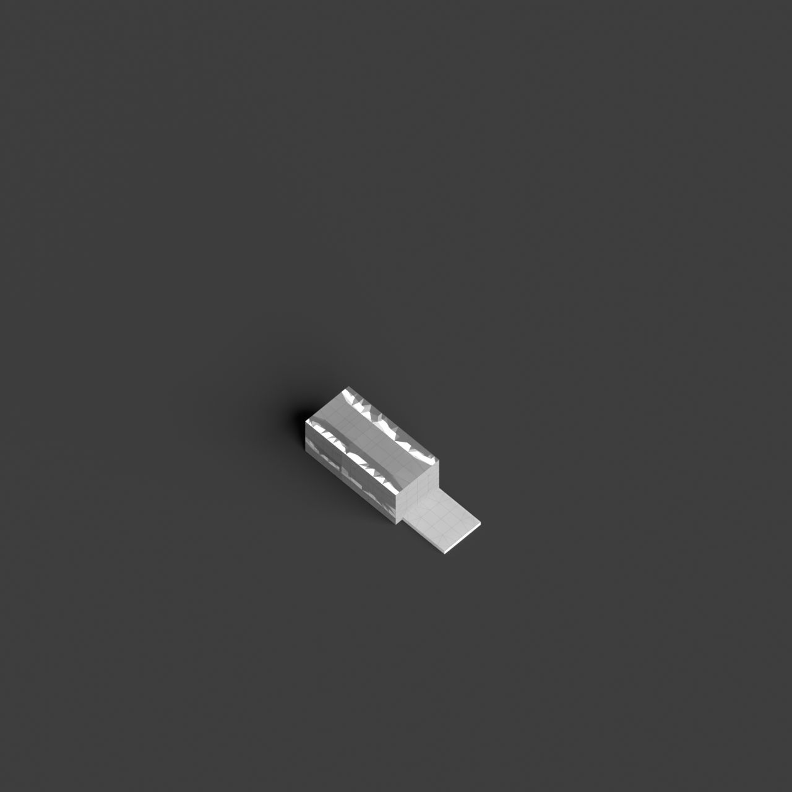
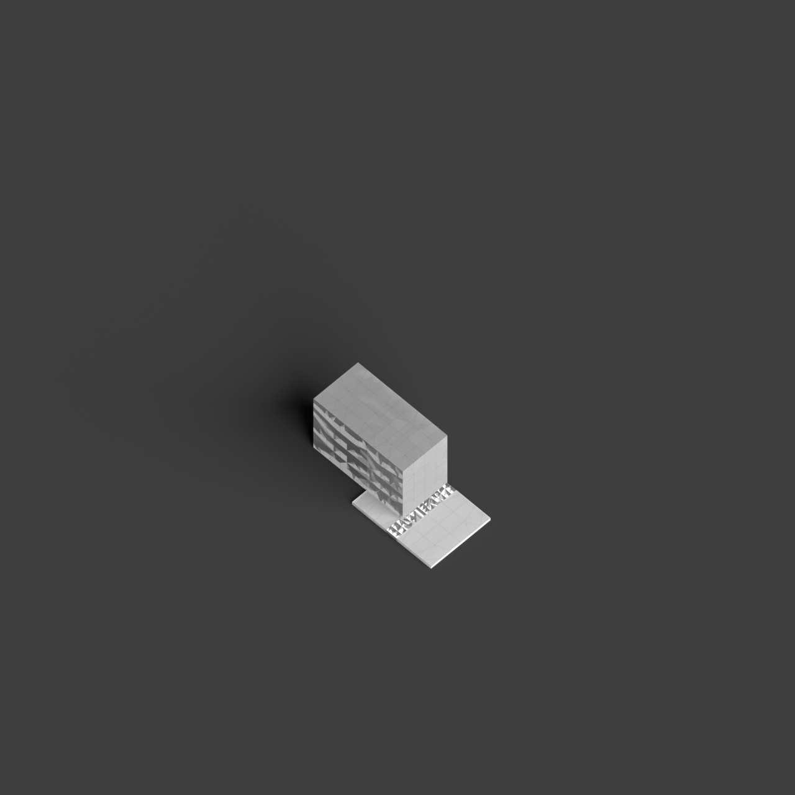
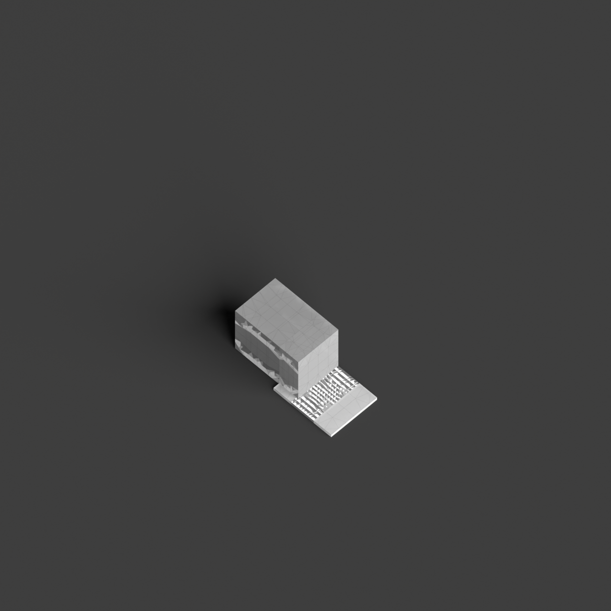
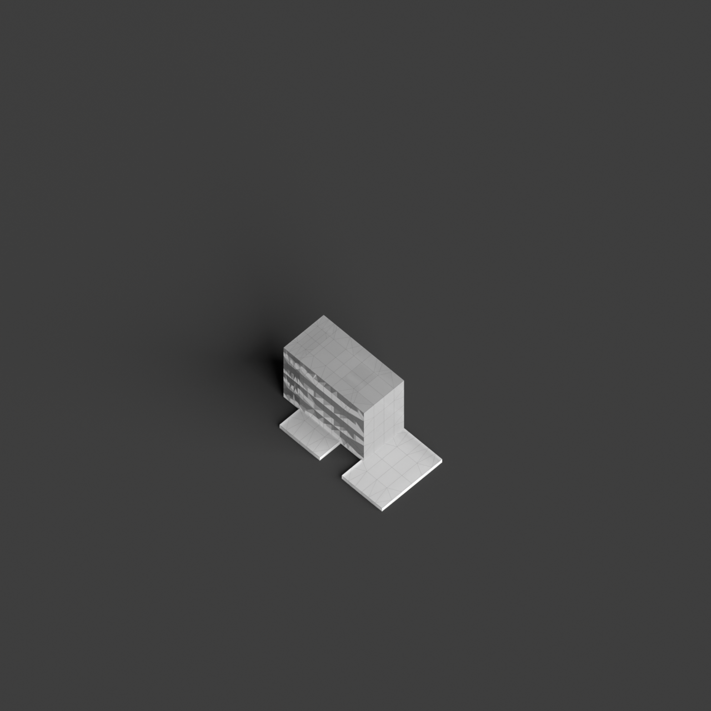

# 0013_0001_0001_split_void  
         
## Interpretation  
  
### Implications_form :  
The &#x27;Split void&#x27; metaphor suggests a building form where a central void or open space acts as a dividing element, creating a bifurcation in the massing. This division could be expressed as a physical gap or a contrasting materiality that clearly distinguishes two halves or sides of the structure. Spatially, the void introduces a dynamic flow, guiding movement and visual connections through the building. The geometry may emphasize linearity or angularity to accentuate the division, while the silhouette is characterized by a pronounced separation that becomes a focal point. The arrangement of spaces around the void could reflect a duality in function or experience, enabling different interactions with natural light and shadow, enhancing the perception of depth and contrast.  
### Metaphor :  
Split void  
### Key_traits :  
The metaphor &#x27;Split void&#x27; implies a design characterized by a clear division or separation within a central open space. This can create a dynamic tension and a sense of duality or contrast within the architecture, allowing for varied interactions with light and shadow. It suggests the creation of distinct zones or pathways and can evoke feelings of openness and movement while maintaining a strong formal identity.  
### Design_task :  
Create an Architectural Concept Model that embodies the &#x27;Split void&#x27; metaphor by designing a structure with a prominent central void that divides the building into two distinct parts. This model should explore the interplay between the divided sections, using contrasting materials or forms on either side of the void to emphasize the separation. Consider the path of light through the space and how it interacts with the void to create dynamic patterns and shadows. The model should also illustrate how the void serves as a circulation or experiential axis, connecting or separating various zones within the design, and reflect the duality or contrast inherent in the metaphor.  
## Agent summary :  
The function `generate_split_void_concept` creates an architectural concept model based on the metaphor &quot;Split void.&quot; By defining parameters for height, width, depth, and a split ratio, it generates a central void that is divided into two distinct volumes, reflecting the metaphor&#x27;s emphasis on separation and contrast. The function utilizes Rhino.Geometry to create geometric representations, including walls that enclose the volumes, enhancing the idea of duality and dynamic tension. This architectural model promotes varied interactions with light and space, aligning with the metaphor&#x27;s essence of openness and movement while retaining a strong formal identity.