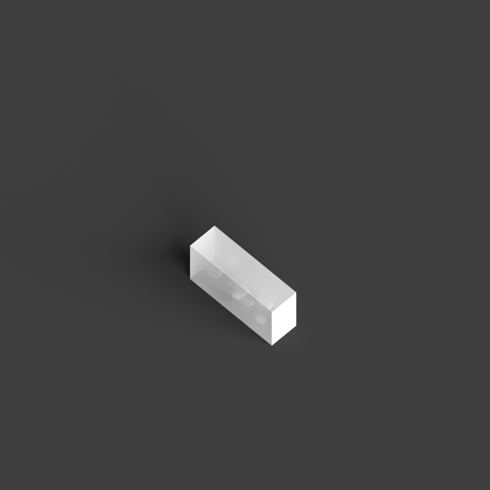
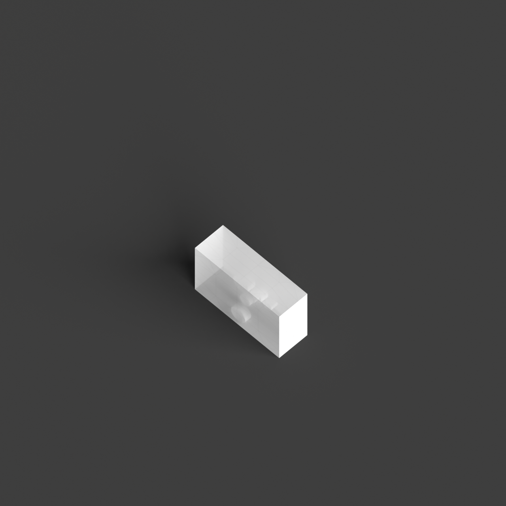
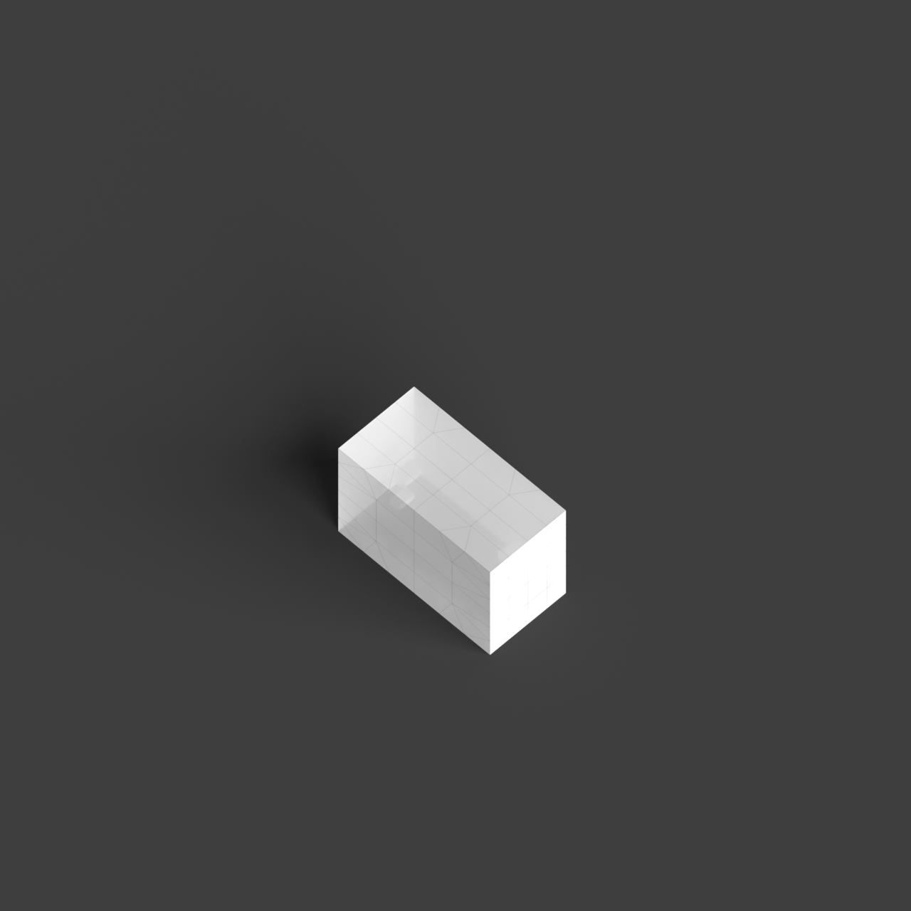

# 0019_0001_0002_subterranean_cavern  
         
## Interpretation  
  
### Implications_form :  
The metaphor of a subterranean cavern suggests a building form that is nestled into the ground, with an emphasis on horizontal massing and organic shapes that mimic natural formations. The building&#x27;s geometry might feature undulating, curvilinear lines and irregular silhouettes to evoke the natural, unrefined character of a cavern. Spatial relationships within the building would prioritize a sequence of spaces that guide exploration, with interconnected chambers and passages that create a sense of mystery and discovery. The design would incorporate varied ceiling heights and floor levels to enhance the feeling of exploration and refuge, with intimate nooks and expansive open areas that mimic the diverse spatial qualities of a cavern.  
### Metaphor :  
subterranean cavern  
### Key_traits :  
The metaphor of a subterranean cavern conveys a sense of exploration, mystery, and refuge. It suggests a design that is immersive and enveloping, with a focus on creating intimate, sheltered spaces. The architecture might incorporate organic forms, use of natural materials, and varied lighting conditions to evoke the feeling of being in a natural, secluded environment.  
### Design_task :  
Create an Architectural Concept Model that embodies the &#x27;subterranean cavern&#x27; metaphor by using clay or a similar malleable material to form organic shapes and varied textures. Carve out interconnected spaces within the model, emphasizing varied levels and intimate alcoves to suggest exploration and refuge. Use translucent materials or strategic openings to experiment with lighting effects that create contrasts between shadowed and illuminated areas, enhancing the mysterious and immersive quality of the design. Focus on achieving a balance between openness and enclosure, capturing the essence of a natural, secluded environment.  
## Agent summary :  
The function `create_subterranean_cavern_model` generates an architectural concept model inspired by the metaphor of a subterranean cavern. It creates an immersive space characterized by exploration and refuge by defining a bounding volume representing the cavern&#x27;s structure. The function also introduces organic voids, which are randomly generated to mimic natural formations, enhancing the sense of mystery. These voids are twisted to add dynamism, reflecting the metaphor&#x27;s intimate and enveloping qualities. The model employs varied dimensions for the cavern and voids, ensuring a unique and organic architectural representation that aligns with the metaphor&#x27;s essence.